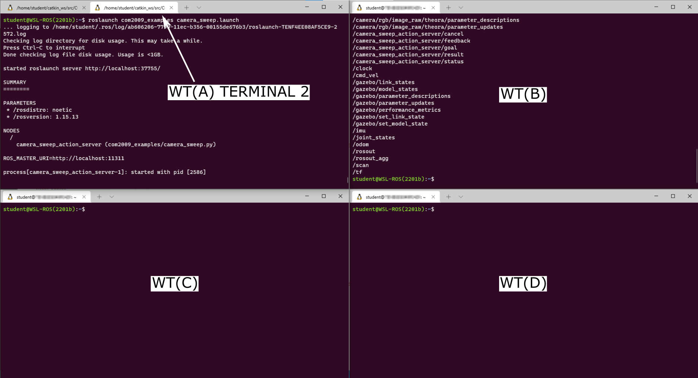

---  
title: "Week 5: ROS Actions"  
subtitle: Building on what you learnt about ROS Services last week, we'll now look at ROS Actions, which work similarly, but with key differences.
---

!!! info
    timings...


## Introduction

### Aims

This week you will learn about a third (and final) communication method available within ROS: *Actions*.  Actions are essentially an advanced version of ROS Services, and you will learn about exactly how these two differ and why you might choose to employ an action over a service for certain robotic tasks. 

### Intended Learning Outcomes

By the end of this session you will be able to:

1. Recognise how ROS Actions differ from ROS Services and explain where this method might be useful in robot applications.
1. Explain the structure of Action messages and identify the relevant information within them, enabling you to build Action Servers and Clients.
1. Implement Python Action *Client* nodes that utilise *concurrency* and *preemption*.
1. Develop Action Server & Client nodes that could be used as the basis for a robotic search strategy.

### Quick Links

* [Exercise 1: Launching an Action Server and calling it from the command-line](#ex1)
* [Exercise 2: Building a Python Action Client Node with concurrency](#ex2)
* [Exercise 3: Building a Preemptive Python Action Client Node](#ex3)
* [Exercise 4: Developing an "Obstacle Avoidance" behaviour using an Action Server](#ex4)
* [Advanced (and optional!) exercises](#advanced)

### Additional Resources

* [The Action Client Code (for Exercise 2)](action_client)
* [The Preemptive Action Client Code (for Exercise 3)](preemptive_action_client)

## Getting Started

**Step 1: Launch WSL-ROS**  
Launch your WSL-ROS environment by running the WSL-ROS shortcut in the Windows Start Menu (if you haven't already done so). Once installed, the *Windows Terminal* app should launch with an *Ubuntu terminal instance* ready to go (**TERMINAL 1**).

**Step 2: Restore your work**  
Restore your work from last time by running the restore script in **TERMINAL 1** now:

***
**TERMINAL 1:**
```bash
wsl_ros restore
```
***

**Step 3: Launch VS Code**  
Follow [these steps](/wsl-ros/vscode) to launch VS Code correctly within the WSL-ROS environment.

## Calling an Action Server

Before we talk about what actions actually are, we're going to dive straight in and see one in *action* (excuse the pun). As you may remember from the Week 3 session, you actually used a ROS Action to make your robot navigate autonomously in [Exercise 4](../week3/#ex4), by calling an action server from the command-line. We will do a similar thing now, in a different context, and this time we'll also look at what's going on in a bit more detail.

#### Exercise 1: Launching an Action Server and calling it from the command-line {#ex1}

We'll play a little game here. We're going to launch our TurtleBot3 Waffle in a *mystery environment* now, and we're going to do this by launching Gazebo *headless* i.e. Gazebo will be running behind the scenes, but there'll be no Graphical User Interface (GUI) to show us what the environment actually looks like.  Then, we'll use an *action server* to make our robot scan the environment and take pictures for us, to reveal its surroundings!

1. To launch our TurtleBot3 Waffle in the mystery environment, use the following `roslaunch` command:

    ***
    **TERMINAL 1:**
    ```bash
    roslaunch tuos_ros_simulations mystery_world.launch
    ```
    ***

    Messages in the terminal should indicate that *something* has happened, but that's about all you will see!

1. Next, *open up a new instance of the Windows Terminal Application* by pressing the "New Tab" button whilst pressing the `Shift` key (we'll call this **WT(B)**).
    
1. In **WT(B)** have a look at all the topics that are currently active on the ROS network (you should know exactly how to do this by now!)<a name="action_launch"></a>

1. Return to the original Windows Terminal instance (the one with the Gazebo processes running, and which we'll now refer to as **WT(A)**), open up a new tab (**WT(A) TERMINAL 2**) and launch an action server that we have already prepared for you for this exercise:

    ***
    **WT(A) TERMINAL 2:**
    ```bash
    roslaunch tuos_ros_examples camera_sweep.launch
    ```
    ***

1. Now, return to **WT(B)** and take a look again at all the topics that are active on the ROS network.
    
    !!! note "Questions"
        * What do you notice?
        * Anything new there now compared to when you ran the same command before?
    
    You should in fact notice 5 new items in that list:<a name="action_msgs"></a>

    ```txt
    /camera_sweep_action_server/cancel
    /camera_sweep_action_server/feedback
    /camera_sweep_action_server/goal
    /camera_sweep_action_server/result
    /camera_sweep_action_server/status
    ```

    A ROS action therefore has *five* messages associated with it. We'll talk about these in a bit more detail later on, but for now, all we need to know is that in order to *call* an action, we need to send the action server a **Goal** (which you may remember doing in [Week 3](../week3/#ex4)).

    !!! info "Comparison to ROS Services"
        This is a bit like sending a **Request** to a ROS Service Server, like we did in the previous session.
    
1. ROS Actions use *topic messages* (unlike ROS Services, which use dedicated *service messages*). We can therefore tap into the ROS network and observe the messages being published to these in exactly the same way as we have done in previous weeks using `rostopic echo`. In order to monitor some of these messages now, we'll launch a couple more instances of the Windows Terminal, so that we can view a few things simultaneously:
    1. Once again, launch an additional Windows Terminal instance by pressing the "New Tab" button whilst pressing the `Shift` key (this one will be called **WT(C)**):
    1. Do this *again* to launch *another Windows Terminal instance*, which we'll call **WT(D)**
    1. You should now have *four* Windows Terminal applications open! Arrange these so that they are all visible: 

    <figure markdown>
      {width=800px}
    </figure>

1. In **WT(C)** run a `rostopic echo` command to *echo* the messages being published to the `/camera_sweep_action_server/feedback` topic:

    ***
    **WT(C):**
    ```bash
    rostopic echo /camera_sweep_action_server/feedback
    ```

    To begin with, you'll see the message:

    ```txt
    WARNING: no messages received and simulated time is active.
    Is /clock being published?
    ```

    Don't worry about this.

    ***

1. Do the same in **WT(D)**, but this time to echo the messages being published to the `/result` part of the action server message.
1. Now, going back to **WT(B)**, run the `rostopic pub` command on the `/camera_sweep_action_server/goal` topic, using the autocomplete functionality in the terminal to help you format the message correctly:

    ***
    **WT(B):**
    ```bash
    rostopic pub /camera_sweep_action_server/goal[SPACE][TAB][TAB]
    ```
    
    Which should provide you with the following:

    ```txt
    rostopic pub /camera_sweep_action_server/goal tuos_ros_msgs/CameraSweepActionGoal "header:
      seq: 0
      stamp:
      secs: 0
      nsecs: 0
      frame_id: ''
    goal_id:
      stamp:
      secs: 0
      nsecs: 0
      id: ''
    goal:
      sweep_angle: 0.0
      image_count: 0"
    ```

1. Edit the `goal` portion of the message by using the left arrow button on your keyboard to scroll back through the message. Modify the `sweep_angle` and `image_count` parameters:
    * **sweep_angle** is the angle (in degrees) that the robot will rotate on the spot
    * **image_count** is the number of images it will capture from its front-facing camera while it is rotating
1. Once you have decided on some values, hit `Enter` to actually publish the message and *call* the action server.
    **Keep an eye on all four terminal instances. What do you notice happening in each of them?**
1. Now, in **WT(B)**:
    1. Cancel the `rostopic pub` command by entering `Ctrl+C`
    1. Once the action had completed, a message should have been published in **WT(D)** (a *"result"*), informing you of the filesystem location where the action server has stored the images that have just been captured by the robot:
            
        ```txt
        result:
          image_path: "~/myrosdata/action_examples/YYYYMMDD_hhmmss"
        ---
        ```
            
    1. Navigate to this directory in **WT(B)** (using `cd`) and have a look at the content using `ll` (a handy alias for the `ls` command):
            
        You should see the same number of image files in there as you requested with the `image_count` parameter.
    
    1. Launch `eog` in this directory and click through all the images to reveal your robot's *mystery environment*:

        ***
        **WT(B):**
        ```bash
        eog .
        ```
        ***

1. Finally, open another tab in the **WT(A)** terminal instance (**WT(A) TERMINAL 3**) and launch the *Gazebo client* to view the simulation that has, until now, been running headless:

    ***
    **WT(A) TERMINAL 3:**
    ```bash
    gzclient
    ```
    ***

1. The actual simulated environment should now be revealed!! To finish off, close down *some* active ROS processes and Windows Terminal instances that we've just been working with:
    1. Close down the `eog` window and the **WT(B)** Windows Terminal instance.
    1. Stop the `rostopic echo` commands that are running in **WT(C)** and **WT(D)** by entering `Ctrl+C` in each of them and then close each of these Windows Terminal instances too.
    1. Enter `Ctrl+C` in **WT(A) TERMINAL 3** to stop the Gazebo GUI, but keep the terminal tab open. 
    1. Leave the processes running in **WT(A) TERMINAL 2** and **1** for now (the Action Server and the headless Gazebo processes).

**Summary:**

Phew, that was a long one! Essentially, what we did here is launched an action server and then called it from the command-line using `rostopic pub`. Hopefully, while the action server was performing the task that we had requested, you also noticed that it was providing us with some *real-time feedback* on how it was getting on (in **WT(C)**). In the same way as a ROS Service, it should also have provided us with a **result** (in **WT(D)**), once the action had been completed.  **Feedback** is one of the key features that differentiates a ROS Action from a ROS Service, but there are other interesting features too, and we'll explore these in more detail now.

## What is a ROS Action?

As you will have observed from the above exercise, a ROS Action actually seems to work a lot like a ROS Service.  We've seen that we have a **feedback** message associated with an Action though, which is indeed different, but this isn't the main differentiating feature. The key difference is that when a node calls a ROS Action (i.e. an action *"Caller"* or *"Client"*), it *doesn't* need to wait until the action is complete before it can move on to something else: it can continue to do other tasks at the same time. Unlike ROS Services then, ROS Actions are *Asynchronous*, which makes them useful when implementing robotic behaviours that take a longer time to execute, and which an Action *Client* might need to be updated on throughout the process.

Recall the five messages associated with the action server [from the exercise above](#action_msgs), the messages had the following names:

```txt
/cancel
/feedback
/goal
/result
/status
```

The top item there hints at the most important feature of ROS Actions: they can be cancelled (or *"preempted"*), which we'll learn more about later.  

The other thing to note is that - where we used the `rosservice` command to interrogate the ROS Services that were active on our ROS network previously - Actions use ROS Topics, so we use `rostopic` commands to interrogate action servers:<a name="rostopic_for_actions"></a>
1. `rostopic list`: to identify the action servers that are available on the network.
1. `rostopic echo`: to view the messages being published by a given action server.
1. `rostopic pub`: to call an action from the command-line. 

### The Format of Action Messages

Like Services, Action Messages have multiple parts to them, and we need to know what format these action messages take in order to be able to call them. We don't have a tool like `rossrv` to do this for Actions though, instead we have to use `rosmsg`, or look for the message definition inside the *Action Message Package*.

We ran `rostopic list` to identify our action server in the previous exercise, which told us that there was an action server running called `/camera_sweep_action_server`:

```txt
rostopic list
[some topics...]
/camera_sweep_action_server/cancel
/camera_sweep_action_server/feedback
/camera_sweep_action_server/goal
/camera_sweep_action_server/result
/camera_sweep_action_server/status
[some more topics...]
```

#### "Cancel" and "Status"

Every ROS Action has both a **cancel** and **status** message associated with them. These are standardised, so the format of these two messages will always be the same, regardless of the type of Action Server we use. We won't worry about these too much for now, but we'll make use of them in some ROS Nodes that we'll build in a short while.

The **feedback**, **goal** and **result** messages will be different for any given action server though, and so we need to know about the format of all of these before we attempt to make a call to the action server.

We can run `rostopic info` on any of these to find out more about them...

#### "Goal"

Let's look at the **goal** to start with:

***
**TERMINAL 1:**
```bash
rostopic info /camera_sweep_action_server/goal
```
From which we obtain the usual information:

```txt    
Type: tuos_ros_msgs/CameraSweepActionGoal

Publishers: None

Subscribers:
  * /camera_sweep_action_server (http://localhost:#####/)
```
***

The `Type` field tells us that the action message belongs to the `tuos_ros_msgs` package, and we can find out more about the `goal` message by using `rosmsg info`. You'll be familiar with how this works by now:

```txt
rosmsg info {messageType}
```

Where `{messageType}` is established from the output of the `rostopic info` command above: 

```txt
Type: tuos_ros_msgs/CameraSweepActionGoal
```

When working with ROS Actions and the `rosmsg` command though, we can actually drop the word "`Action`" in the message Type, so our `rosmsg` command becomes:

***
**TERMINAL 1:**
```bash
rosmsg info tuos_ros_msgs/CameraSweepGoal
```
Which will output:

```txt
float32 sweep_angle
int32 image_count
```
***

!!! info
    `rosmsg info tuos_ros_msgs/CameraSweepActionGoal` will work as well, but we get a lot of other information in the output that we're not all that interested in. Give it a go and see the difference, if you want to!

In order to call this action server, we need to send a **goal**, and `rosmsg info` has just told us that there are **two** goal parameters that we must provide:

1. `sweep_angle`: a 32-bit floating-point value
1. `image_count`: a 32-bit integer

So we know more about our Action Server's *Goal* now, but there are two other parameters we still know nothing about: *Result* and *Feedback*. It's important to know about all three things in order to be able to work with the Action Server effectively, and we can use an alternative approach to interrogate all three at the same time...

#### "Goal," "Feedback" and "Result"

We know, from above, that the `/camera_sweep_action_server` messages are part of the `tuos_ros_msgs` package, so we can navigate to the package directory (using `roscd`) and look at the actual message definition. 

***
**TERMINAL 1:**
```bash
roscd tuos_ros_msgs/
```
***

Actions are always contained within an `action` folder inside the package directory, so we can then navigate into this folder using `cd`:

***
**TERMINAL 1:**
```bash
cd action/
```
***

Use the `ll` command again here to view all the action messages within the package. Here you should see the `CameraSweep.action` message listed. Run `cat` on this file to view the full message definition:<a name="camera_sweep_msg_params" ></a>

***
**TERMINAL 1:**
```bash
cat CameraSweep.action
```
```txt
#goal
float32 sweep_angle    # the angular sweep over which to capture images (degrees)
int32 image_count      # the number of images to capture during the sweep
---
#result
string image_path      # The filesystem location of the captured images
---
#feedback
int32 current_image    # the number of images taken
float32 current_angle  # the current angular position of the robot (degrees)
```

!!! note "Questions"
    * What are the names of the **result** and **feedback** message parameters? (There are three parameters in total.)
    * What datatypes do these parameters use?

You'll learn how we use this information to develop Python Action Server & Client nodes in the following exercises.

### Concurrent Activity

An Action Server provides **feedback** messages at regular intervals whilst performing an action and working towards its **goal**.  This is one way that an Action Client can monitor the progress of the action that it has requested.  Another way it can do this is by monitoring the **status** of an action.  Both of these features enable *concurrency*, allowing an action client to work on other things whilst waiting for the requested behaviour to be completed by the action server.


#### Exercise 2: Building a Python Action Client Node with Concurrency {#ex2}

1. You should only have one Windows Terminal application instance open now, with three WSL-ROS terminal tabs in it. **TERMINAL 3** should already be idle (i.e. not running any commands), and (if you haven't done so already) enter `Ctrl+C` in **TERMINAL 1** and **TERMINAL 2** to stop the headless Gazebo simulation processes and the Camera Sweep Action Server respectively. 
1. In **TERMINAL 1** create a new package called `week5_actions` using the `catkin_create_pkg` tool [as you have done previously](../week4/#ex1). This time, define `rospy`, `actionlib` and `tuos_ros_msgs` as dependencies.
    
    !!! tip "Remember"
        Make sure you're in your `~/catkin_ws/src/` folder when you run the `catkin_create_pkg` command!
    
1. Once again, run `catkin build` on this and then re-source your environment:

    ***
    **TERMINAL 1:**  
    First:
    ```bash
    catkin build week5_actions
    ```
    Then:
    ```bash
    source ~/.bashrc
    ```
    ***

1. Navigate to the `src` folder of this package, create a file called `action_client.py` (using `touch`) and set this to be executable (using `chmod`).        
1. Review [the code provided here](action_client), and the annotations, then copy and paste the code into your newly created `action_client.py` file.
1. Then, in **TERMINAL 2**, execute the same launch file as before but this time with a couple of additional arguments:

    ***
    **TERMINAL 2:**
    ```bash
    roslaunch tuos_ros_simulations mystery_world.launch gui:=true camera_search:=true
    ```
    
    ... which will launch the Gazebo simulation in GUI mode this time, as well as the `/camera_sweep_action_server` too.

    ***

1. In **TERMINAL 1**, use `rosrun` to call the action server with the `action_client.py` node that you have just created...

    ... something not right? You may need to change the values that have been assigned to the goal parameters, in order for the client to successfully make a call to the server!

    The node we have just created, in its current form, uses a *feedback callback function* to perform some operations while the action server is working. In this case, it simply prints the feedback data that is coming from the Action Server.  That's it though, and the `client.wait_for_result()` line still essentially just makes the client node wait until the action server has finished doing its job before it can do anything else. This still therefore looks a lot like a service, so let's modify this now to really build *concurrency* into the client node.

1. First, create a copy of your `action_client.py` node and call it `concurrent_action_client.py` (you will need to make sure you are still in the `src` directory of your `week5_actions` package before you run this command):

    ***
    **TERMINAL 1:**
    ```bash
    cp action_client.py concurrent_action_client.py
    ```
    ***

1. We want to use the **status** message from the action server now, and we can find out a bit more about this as follows:
    1. Use `rostopic info camera_sweep_action_server/status` to find the message type.
    1. Then, use `rosmsg info` (using the message type you have just identified) to tell you all the status codes that could be returned by the action server.

    You should have identified the following states, listed in the `status_list` portion of the message:

    ```txt
    PENDING=0
    ACTIVE=1
    PREEMPTED=2
    SUCCEEDED=3
    ABORTED=4
    REJECTED=5
    ...
    ```

    We can set up our action client to monitor these status codes in a `while` loop, and then perform other operations inside this loop until the action has completed (or has been stopped for another reason).
1. To do this, replace the `client.wait_for_result()` line in the `concurrent_action_client.py` file with the following code:

    ```python
    rate = rospy.Rate(1)
    i = 1
    print("While we're waiting, let's do our seven-times tables...")
    while client.get_state() < 2:
        print(f"STATE: Current state code is {client.get_state()}")
        print(f"TIMES TABLES: {i} times 7 is {i*7}")
        i += 1
        rate.sleep()
    ```
1. Run the `concurrent_action_client.py` node and see what happens this time.  Essentially, we know that we can carry on doing other things as long as the status code is less than 2 (either `PENDING` or `ACTIVE`), otherwise either our goal has been achieved, or something else has happened...

### Cancelling (or *Preempting*) an Action {#preemptive_client}

Actions are extremely useful for controlling robotic tasks or processes that might take a while to complete, but what if something goes wrong, or if we just change our mind and want to stop an action before the goal has been reached? The ability to *preempt* an action is one of the things that makes them so useful.

#### Exercise 3: Building a Preemptive Python Action Client Node {#ex3}

1. In **TERMINAL 1** you should still be located within the `src` folder of your `week5_actions` package. If not, then go back there now! Create a new file called `preemptive_action_client.py` and make this executable.
1. Have a look at the code [here](preemptive_action_client), then copy and paste it into the `preemptive_action_client.py` node that you have just created.
    Here, we've built an action client that will cancel the call to the action server if we enter `Ctrl+C` into the terminal.  This is useful, because otherwise the action server would continue to run, even when we terminate the client.  A lot of the code is similar to the Action Client from the previous exercise, but we've built a class structure around this now for more flexibility.  Have a look at [the explainer](preemptive_action_client/#explainer) and make sure that you understand how it all works.
1. Run this using `rosrun`, let the server take a couple of images and then enter `Ctrl+C` to observe the goal cancelling in action.

    !!! note
        You'll need to set some values for the goal parameters again!
    
1. We can also cancel a goal conditionally, which may also be useful if, say, too much time has elapsed since the call was made, or the caller has been made aware of something else that has happened in the meantime (perhaps we're running out of storage space on the robot and can't save any more images!) This is all achieved using the `cancel_goal()` method.

    * Have a go now at introducing a conditional call to the `cancel_goal()` method once a total of **5 images** have been captured.
    * You could do this inside the `feedback_callback()` class method.
    * You could use the `captured_images` attribute from the `CameraSweepFeedback` message to trigger this.

### A Summary of ROS Actions

ROS Actions work a lot like ROS Services, but they have the following key differences:
1. They are **asynchronous**: a client can do other things while it waits for an action to complete.
1. They can be **cancelled** (or *preempted*): If something is taking too long, or if something else has happened, then an Action Client can cancel an Action whenever it needs to.
1. They provide **feedback**: so that a client can monitor what is happening and act accordingly (i.e. preempt an action, if necessary).

<figure markdown>
  
</figure>

This mechanism is therefore useful for robotic operations that may take a long time to execute, or where intervention might be necessary.

## Creating Action Servers in Python {#cam_swp_act_srv}

!!! info "Important"
    Cancel *all* active processes that you may have running before moving on.

So far we have looked at how to call an action server, but what about if we actually want to set up our own? We've been working with a pre-made action server in the previous exercises, but so far we haven't really considered how it actually works. First, let's do some detective work... We launched the Action Server using `roslaunch` in Exercise 1:

```bash
roslaunch tuos_ros_examples camera_sweep.launch
```

!!! note "Questions"
    * What does this tell us about the *package* that the action server node belongs to?
    * Where, in the package directory, is this node likely to be located?
    * How might we find out the name of the Python node from the `camera_sweep.launch` file?

Once you've identified the name and the location of the source code, open it up in VS Code and have a look through it to see how it all works.

Don't worry too much about all the content associated with obtaining and manipulating camera images in there, we'll learn more about this in the next session. Instead, focus on the general overall structure of the code and the way that the action server is implemented.

1. As a starting point, consider the way in which the action server is initialised and the way a callback function is defined to encapsulate all the code that will be executed when the action is called:

    ```python
    self.actionserver = actionlib.SimpleActionServer("/camera_sweep_action_server", 
        CameraSweepAction, self.action_server_launcher, auto_start=False)
    self.actionserver.start()
    ```

1. Look at how a `/cmd_vel` publisher and an `/odom` subscriber are defined in external classes:<a name="tb3_module" ></a>

    ```python
    self.robot_controller = Tb3Move()
    self.robot_odom = Tb3Odometry()
    ```

    These are imported (at the start of the code) from an external `tb3.py` module that also lives in the same directory as the action server itself:

    ```python
    from tb3 import Tb3Move, Tb3Odometry
    ```

    We do this to simplify the process of obtaining odometry data and controlling the robot, whilst keeping the actual action server code itself more concise. Have a look at the `tb3.py` module to discover exactly how these Python classes work.

1. Look inside the action server callback function to see how the camera sweep operation is performed once the action has been called:

    ```python
    def action_server_launcher(self, goal):
        ...
    ```

    1. Consider the error checking that is performed on the `goal` input variables, and how the call to the action server is aborted should any of these goal requests be invalid:

        ```python
        success = True
        if goal.sweep_angle <= 0 or goal.sweep_angle > 180:
            print("Invalid sweep_angle! Select a value between 1 and 180 degrees.")
            success = False
            ...

        if not success:
            self.result.image_path = "None [ABORTED]"
            self.actionserver.set_aborted(self.result)
            return
        ```

    1. Consider how preemption is implemented in the server, and how the Action is stopped on receipt of a preempt request:

        ```python    
        if self.actionserver.is_preempt_requested():
            ...
        ```

    1. Also have a look at the way a `feedback` message is constructed and published by the server:

        ```python
        self.feedback.current_image = i
        self.feedback.current_angle = abs(self.robot_odom.yaw)
        self.actionserver.publish_feedback(self.feedback)
        ```

    1. Finally, consider how we tell the server that the action has been completed successfully, how the `result` message is published to the caller, and how we make the robot stop moving:

        ```python
        if success:
            rospy.loginfo("Camera sweep completed successfully.")
            self.actionserver.set_succeeded(self.result)
            self.robot_controller.stop()
        ```

#### Exercise 4: Developing an "Obstacle Avoidance" behaviour using an Action Server {#ex4}

Knowing what you now do about ROS Actions, do you think the Service Server/Client systems that we developed last week were actually appropriate use cases for ROS Services?  Probably not!  In fact, *Action* Server/Client methods would have probably been more appropriate! 

You are now going to construct your own Action Server and Client nodes to implement a more effective obstacle avoidance behaviour that could form the basis of an effective search strategy. For this, you're going to need to build your own Search Server and Client.

**Step 1: Launch a simulation**

There's a simulation environment that you can use as you're developing your action server/client nodes for this exercise. Launch the simulation in **TERMINAL 1**, with the following `roslaunch` command: 

***
**TERMINAL 1:**
```bash
roslaunch turtlebot3_gazebo turtlebot3_stage_4.launch
```
***

**Step 2: Build the Action Server**

1. In **TERMINAL 2** navigate to the `src` folder of your `week5_actions` package, create a Python script called `search_server.py`, and make it executable.

1. The job of the Action Server node is as follows:

    * The action server should make the robot move forwards until it detects an obstacle up ahead.
    * Similarly to the *Service* Server that you created last week, your *Action* Server here should be configured to accept two **goal** parameters:
        1. The speed (in m/s) at which the robot should move forwards when the action server is called. Consider doing some error checking on this to make sure a velocity request is less than the maximum speed that the robot can actually achieve (0.26 m/s)!
        1. The distance (in meters) at which the robot should stop ahead of any objects or boundary walls that are in front of it. To do this you'll need to subscribe to the `/scan` topic. Be aware that an object won't necessarily be directly in front of the robot, so you may need to monitor a range of `LaserScan` data points (within the `ranges` array) to make the collision avoidance effective (recall the [LaserScan callback example](../week4/scan_callback) and also have a look at the `Tb3LaserScan` class within the `tuos_ros_examples/tb3.py` module that might help you with this).
    * Whilst your server performs its task it should provide the following **feedback** to the Action Caller:
        1. The distance travelled (in meters) since the current action was initiated.

            To do this you'll need to subscribe to the `/odom` topic. Remember that there's a `Tb3Odometry` class within [the `tuos_ros_examples/tb3.py` module](#tb3_module) that might help you with obtaining this data.
            
            Remember also that your robot's orientation shouldn't change over the course of a single action call, only its `linear.x` and `linear.y` positions should vary.  Bear in mind however that the robot won't necessarily be moving along the `X` or `Y` axis, so you will need to consider the total distance travelled in the `X-Y` plane.  You should have done this in the [Week 3 `move_square` exercise](../week3/#ex1), so refer to this if you need a reminder.

    * Finally, on completion of the action, your server should provide the following *three* **result** parameters:
        1. The *total* distance travelled (in meters) over the course of the action.
        1. The distance to the obstacle that made the robot stop (this should match, or very close to, the distance that was provided by the Action Client in the **goal**).
        1. The angle (in degrees) at which this obstacle is located in front of the robot (`Tb3LaserScan` class within the `tuos_ros_examples/tb3.py` module, which may already provide this).

1. An action message has been created for you to use for this exercise: `tuos_ros_msgs/Search.action`.  Navigate to the `action` folder of the `tuos_ros_msgs` package directory (or use `rosmsg info ...` in the terminal) to find out everything you need to know about this action message in order to develop your Action Server (and Client) nodes appropriately.

1. We've put together [some template code](search_server) to help you with this. For further guidance though, you should also refer to the code for `/camera_sweep_action_server` node, which [we talked about earlier](#cam_swp_act_srv): a lot of the techniques used by `/camera_sweep_action_server` node will be similar to what you'll need to do in this exercise. <a name="ex4_ret"></a>

1. Whenever you're ready you can launch your action server from **TERMINAL 2**, using `rosrun`, as below:

    ***
    **TERMINAL 2:**
    ```bash
    rosrun week5_actions search_server.py
    ```
    ***

**Step 3: Build the Action Client**

1. In **TERMINAL 3** navigate to the `src` folder of your `week5_actions` package, create a Python script called `search_client.py`, and make it executable.

1. The job of the Action Client node is as follows:

    * The client needs to issue a correctly formatted **goal** to the server.
    * The client should be programmed to monitor the **feedback** data from the Server.  If it detects (from the feedback) that the robot has travelled a distance *greater than 2 meters* without detecting an obstacle, then it should cancel the current action call using the `cancel_goal()` `actionlib` method.

1. Use the techniques that we used in the Client node from [Exercise 3](#ex3) as a guide to help you with this. There's also [a code template here](search_client) to help you get started. <a name="ex4c_ret"></a>

1. Once you have everything in place launch the action client with `rosrun` as below:

    ***
    **TERMINAL 3:**
    ```bash
    rosrun week5_actions action_client.py
    ```
    ***

    If all is good, then this client node should call the action server, which will - in turn - make the robot move forwards until it reaches a certain distance from an obstacle up ahead, at which point the robot will stop, and your client node will stop too. Once this happens, reorient your robot (using the `turtlebot3_teleop` node) and launch the client node again to make sure that it is robustly stopping in front of obstacles repeatedly, and when approaching them from a range of different angles. 

    !!! info "Important"
        Make sure that your preemption functionality works correctly too, so that the robot never moves any further than 2 meters during a given action call!

## Some advanced exercises (if you're feeling adventurous!) {#advanced}

Want to do more with the ROS skills that you have now developed?! Consider the following advanced exercises that you could try out now that you know how to use ROS Actions!

!!! note
    We know that you have done a lot this week already, and these are really just suggestions for more advanced things that you may want to explore in your own time, or to help with the further work that you will do in Lab Assignment #2...

#### Advanced Exercise 1: Implementing a Search strategy {#adv_ex1}

What you developed in [the previous exercise](#ex4) could be used as the basis for an effective robot search strategy.  Up to now, your Action Client node should have the capability to call your `Search.action` server to make the robot move forwards by 2 meters, or until it reaches an obstacle (whichever occurs first), but you could enhance this further:

* Between action calls, your *client* node could make the robot turn on the spot to face a different direction and then issue a further action call to make the robot move forwards once again.
* The turning process could be done at random, or it could be informed by the **result** of the last action call, i.e.: if (on completion) the server has informed the client that it detected an object at an angle of, say, 10&deg; *anti-clockwise* from the front of the robot, then the client might then decide to turn the robot *clockwise* in an attempt to turn away from the object before issuing its next action call to make the robot move forwards again.
* By programming your client node to repeat this process over and over again, the robot would (somewhat randomly) travel around its environment safely, stopping before it crashes into any obstacles and reorienting itself every time it stops moving forwards. *This is effectively an implementation of a basic robotic search strategy!* 

    !!! tip "Enhancing this further..."
        Imagine SLAM was running at the same time too... your robot could be building up a map of its environment in the background as it slowly explored every part of it!

#### Advanced Exercise 2: Autonomous Navigation using waypoint markers {#adv_ex2}

In the Week 3 session you used SLAM to construct a map of an environment ([Exercise 3](../week3/#ex3)) and then issued navigation requests to the `move_base` action server, via the command-line, ([Exercise 4](../week3/#ex4)) to make your robot move to a zone marker, based on coordinates that you had established beforehand. Now that you know how to build Action Client Nodes in Python you could return to your `week2_navigation` package and build a new node that makes the robot move sequentially between each zone marker programmatically.

* Your node could cycle through the coordinates of all four of the zone markers (or "waypoints") that you established whilst using SLAM to build a map of the environment ([as per Exercise 3](../week3/#ex3)).
* Your node could monitor the status of the `move_base_simple` action call to know when the robot has reached a zone marker, so that it knows when to issue a further action call to move on to the next one.
* You could refer to [the launch file that you created in the Week 3 session](../week3/#launch_file) to launch all the Navigation processes that need to be running in order to enable and configure the ROS Navigation Stack appropriately for the TurtleBot3 robot.

## Wrapping Up

In this session you've learnt:

* How ROS Actions work and why they might be useful.
* How to develop Action Client Nodes in Python which can perform other tasks *concurrently* to the action they have requested, and which can also *cancel* the requested action, if required.
* How to use standard ROS tools to interrogate the topic messages used by an action server, allowing you to build clients to call them, and to also allow you to build standalone action servers yourself using bespoke Action messages.
* How to harness this communication method to implement a behaviour that could be used as the basis for a genuine robotic *search strategy*. 

### Topics, Services or Actions: *Which to Choose?*

You should now have developed a good understanding of the three communication methods that are available within ROS to facilitate communication between ROS Nodes:

1. Topic-based messaging.
1. ROS Services.
1. ROS Actions.

Through this course you've now gained some practical experience using all three of these, but you may still be wondering how to select the appropriate one for a certain robot task... 

[This ROS.org webpage](https://wiki.ros.org/ROS/Patterns/Communication#Communication_via_Topics_vs_Services_vs_X) summarises all of this very nicely (and briefly), so you should have a read through this to make sure you know what's what. In summary though:

* **Topics**: Are most appropriate for broadcasting continuous data-streams such as sensor data and robot state information, and for publishing data that is likely to be required by a range of Nodes across a ROS network.
* **Services**: Are most appropriate for very short procedures like *quick* calculations (inverse kinematics etc.) and performing short discrete actions that are unlikely to go wrong or will not need intervention (e.g. turning on a warning LED when a battery is low).
* **Actions**: Are most appropriate for longer running tasks (like moving a robot), for longer processing calculations (processing the data from a camera stream) or for operations where we *might* need to change our mind and do something different or cancel an invoked behaviour part way through.
    
### Saving your work {#backup}

Remember, the work you have done in the WSL-ROS environment during this session **will not be preserved** for future sessions or across different University machines automatically! To save the work you have done here today you should now run the following script in any idle WSL-ROS Terminal Instance:

```bash
wsl_ros backup
```

This will export your home directory to your University U: Drive, allowing you to restore it at the start of the next session.