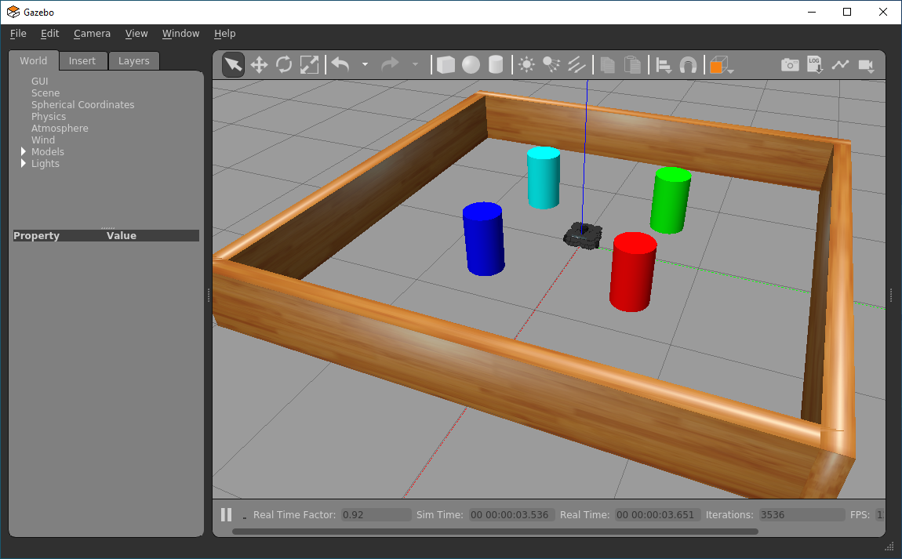

## Introduction

:material-pen: **Exercises**: 4  
:material-timer: **Estimated Completion Time**: 2 hours

### Aims

In this final part of the course you will *finally* make use of the TurtleBot3's camera, and look at how to work with images in ROS! Here we'll look at how to build ROS nodes that capture images and process them. We'll explore some ways in which this data can be used to inform decision-making in robotic applications.  

### Intended Learning Outcomes

By the end of this session you will be able to:

1. Use a range of ROS tools to interrogate camera image topics on a ROS Network and view the images being streamed to them.
1. Use the computer vision library *OpenCV* with ROS, to obtain camera images and process them in real-time.  
1. Apply filtering processes to isolate objects of interest within an image.
1. Develop object detection nodes and harness the information generated by these processes to control a robot's position.
1. Use camera data as a feedback signal to implement a line following behaviour using proportional control.

### Quick Links

* [Exercise 1: Using the `rqt_image_view` node whilst changing the robot's viewpoint](#ex1)
* [Exercise 2: Object Detection](#ex2)
* [Exercise 3: Locating image features using *Image Moments*](#ex3)
* [Exercise 4: Line following](#ex4)

### Additional Resources

* [The Initial Object Detection Code (for Exercise 2)](object_detection)
* [A Complete Worked Example of the `object_detection.py` Node](object_detection_complete)
* [A `line_follower` Template (for Exercise 4)](line_follower)

## Getting Started

**Step 1: Launch WSL-ROS**  
Launch your WSL-ROS environment by running the WSL-ROS shortcut in the Windows Start Menu (if you haven't already done so). Once installed, the *Windows Terminal* app should launch with an *Ubuntu terminal instance* ready to go (**TERMINAL 1**).

**Step 2: Restore your work**  
When prompted (in **TERMINAL 1**), enter `Y` to restore your work from last time[^1].

[^1]: You can also use the `wsl_ros restore` command.

**Step 3: Launch VS Code**  
Follow [these steps](../../../wsl-ros/vscode) to launch VS Code correctly within the WSL-ROS environment.

**Step 4: Launch the Robot Simulation**  
In this session we'll start by working with the same *mystery world* environment from Part 5. In **TERMINAL 1**, use the following `roslaunch` command to load it:

***
**TERMINAL 1:**
```bash
roslaunch tuos_simulations coloured_pillars.launch
```
...and then wait for the Gazebo window to open:

<figure markdown>
  {width=800px}
</figure>

## Working with Cameras and Images in ROS

### Camera Topics and Data

There are a number of tools that we can use to view the live images that are being captured by a robot's camera in ROS. As with all robot data, these streams are published to *topics*, so we firstly need to identify those topics.

In a new terminal instance (**TERMINAL 2**), run `rostopic list` to see the full list of topics that are currently active on our system. Conveniently, all the topics related to our robot's *camera* are prefixed with `camera`! Filter the `rostopic list` output using `grep` (a Linux command), to filter the list and only show topics prefixed with `/camera`:

***
**TERMINAL 2:**
```bash
rostopic list | grep /camera
```

This should provide the following filtered list:

``` { .txt .no-copy }
/camera/depth/camera_info
/camera/depth/image_raw
/camera/depth/points
/camera/parameter_descriptions
/camera/parameter_updates
/camera/rgb/camera_info
/camera/rgb/image_raw
/camera/rgb/image_raw/compressed
/camera/rgb/image_raw/compressed/parameter_descriptions
/camera/rgb/image_raw/compressed/parameter_updates
/camera/rgb/image_raw/compressedDepth
/camera/rgb/image_raw/compressedDepth/parameter_descriptions
/camera/rgb/image_raw/compressedDepth/parameter_updates
/camera/rgb/image_raw/theora
/camera/rgb/image_raw/theora/parameter_descriptions
/camera/rgb/image_raw/theora/parameter_updates
```

***

Our *real* TurtleBot3 Waffles in the Diamond have a slightly different camera module to that used by the *simulated* robots that we are working with here.  Despite this though, the camera data on our real robots is published to topics using the same ROS message formats as used in simulation, making it fairly straight-forward to transfer nodes that we develop in simulation here onto the real robots[^2].

[^2]: Camera topic names are slightly different on the real robots though, so look out for that!

The first items in the list of camera topics above tell us that *depth* information is available here. Much like the real robots, the simulated versions that we are working with here also have a camera module capable of determining depth information as well as simply capturing images.  [Remember from Part 3 though](../part3/#lidar), that we also have a very capable LiDAR sensor to give us this type of information too, and so we won't really be using the depth capabilities of our camera in this session.

The main thing we are actually interested in here is the *RGB images* that are captured by the camera, and the key topic that we'll therefore be using here is:

``` { .txt .no-copy }
/camera/rgb/image_raw
```

Run `rostopic info` on this to identify the message *type*.

Now, run `rosmsg info` on this message type to find out exactly what information is published to the topic.  You should end up with a list that looks like this:

``` { .txt .no-copy }
std_msgs/Header header
  uint32 seq
  time stamp
  string frame_id
uint32 height
uint32 width
string encoding
uint8 is_bigendian
uint32 step
uint8[] data
```

<a name="cam_img_questions"></a>

!!! question "Questions"
    1. What *type* of message is used on this topic, and which *package* is this message derived from?
    1. Using `rostopic echo` and the information about the topic message (as shown above) determine the *size* of the images that our robot's camera will capture (i.e. its *dimensions*, in pixels).  It will be quite important to know this when we start manipulating these camera images later on. 
    1. Finally, considering the list above again, which part of the message do you think contains the *actual image data*?

### Visualising Camera Streams {#viz}

We can *view* the images being streamed to the above camera topic (in real-time) in a variety of different ways, and we'll explore a couple of these now.

One way is to use *RViz*, which can be launched using the following `roslaunch` command:

***
**TERMINAL 2:**
```bash
roslaunch turtlebot3_gazebo turtlebot3_gazebo_rviz.launch
```
***

Once RViz launches, find the camera item in the left-hand panel and tick the checkbox next to it. This should open up a camera panel with a live stream of the images being obtained from the robot's camera!  The nice thing about this is that the real-time LiDAR data will also be overlaid on top of the images too!

<figure markdown>
  {width=800px}
</figure>

Close down RViz by entering ++ctrl+c++ in **TERMINAL 2**.  

#### :material-pen: Exercise 1: Using the RQT Image View node whilst changing the robot's viewpoint {#ex1}

Another tool we can use to view camera data-streams is the `rqt_image_view` node.

1. To launch this, use `rosrun` as follows:

    ***
    **TERMINAL 2:**
    ```bash
    rosrun rqt_image_view rqt_image_view
    ```
    <figure markdown>
      
    </figure>

    This is a nice tool that allows us to easily view images that are being published to any camera topic on the ROS network. Another useful feature is the ability to save these images (as `.jpg` files) to the filesystem: See the "Save as image" button highlighted in the figure above. This might be useful later on...

    ***

1. Click the drop-down box in the top left of the window to select an image topic to display.  Select `/camera/rgb/image_raw` (if it's not already selected).

1. Keep this window open now, and launch a new terminal instance (**TERMINAL 3**).

1. Launch the `turtlebot3_teleop` node, either using [the full command](../part1/#teleop) or a handy alias: `tb3_teleop`! Rotate your robot on the spot, keeping an eye on the `rqt_image_view` window as you do this.  Stop the robot once one of the coloured pillars in the arena is roughly in the centre of the robot's field of vision, then close the `turtlebot3_teleop` node and the `rqt_image_view` node by entering ++ctrl+c++ in **TERMINAL 3** and **TERMINAL 2** respectively.

## OpenCV and ROS {#opencv}

[OpenCV](https://opencv.org/) is a mature and powerful computer vision library designed for performing real-time image analysis, and it is therefore extremely useful for robotic applications.  The library is cross-platform and there is a Python API (`cv2`), which we'll be using to do some computer vision tasks of our own during this lab session. While we can work with OpenCV using Python straight away (via the API), the library can't directly interpret the native image format used by the ROS, so there is an *interface* that we need to use.  The interface is called [CvBridge](http://wiki.ros.org/cv_bridge), which is a *ROS package* that handles the conversion between ROS and OpenCV image formats.  We'll therefore need to use these two libraries (OpenCV and CvBridge) hand-in-hand when developing ROS nodes to perform computer vision related tasks.

### Object Detection

One common job that we often want a robot to perform is *object detection*, and we will illustrate how this can be achieved using OpenCV tools for *colour filtering*, to detect the coloured pillar that your robot should now be looking at.  

#### :material-pen: Exercise 2: Object Detection {#ex2}

In this exercise you will learn how to use OpenCV to capture images, filter them and perform other analysis to confirm the presence and location of features that we might be interested in.

**Step 1**

1. First create a new package in your `catkin_ws/src` directory called `part6_vision` with `rospy`, `cv_bridge`, `sensor_msgs` and `geometry_msgs` as dependencies.
1. Then, run `catkin build` on the package and then re-source your environment (as you've done so many times by now!)
1. In the `src` folder of the package you have just created, create a new Python file called `object_detection.py`. *What else do we need to do to this file before we can run it?* **Do it now!**
1. Copy [the code here](object_detection), save the file, then read the annotations so that you understand how this node works and what should happen when you run it. <a name="ex2_ret"></a>
1. Run the node using `rosrun`.

    !!! warning
        This node will capture an image and display it in a pop-up window. Once you've viewed the image in this pop-up window **MAKE SURE YOU CLOSE THE POP-UP WINDOW DOWN** so that the node can complete its execution!
    
1. As you should know from reading the explainer, the node has just obtained an image and saved it to a location on the filesystem.  Navigate to this filesystem location and view the image using `eog`.

What you may have noticed from the terminal output when you ran the `object_detection.py` node is that the robot's camera captures images at a native size of 1080x1920 pixels (you should already know this from interrogating the `/camera/rgb/image_raw/width` and `/height` messages using `rostopic echo` earlier, right?!).  That's over 2 million pixels in total in a single image (2,073,600 pixels per image, to be exact), each pixel having a blue, green and red value associated with it - so that's a lot of data in a single image file! 

!!! question
    The size of the image file (in bytes) was actually printed to the terminal when you ran the `object_detection.py` node. Did you notice how big it was exactly?

Processing an image of this size is therefore hard work for a robot: any analysis we do will be slow and any raw images that we capture will occupy a considerable amount of storage space. The next step then is to reduce this down by cropping the image to a more manageable size.

**Step 2**

We're going to modify the `object_detection.py` node now to:

* Capture a new image in its native size
* Crop it down to focus in on a particular area of interest
* Save both of the images (the cropped one should be much smaller than the original).

1. In your `object_detection.py` node locate the line:

    ``` { .python .no-copy}
    show_and_save_image(cv_img, img_name = "step1_original")
    ```

1. **Underneath this**, add the following additional lines of code:

    ```python
    crop_width = width - 400
    crop_height = 400
    crop_y0 = int((width / 2) - (crop_width / 2))
    crop_z0 = int((height / 2) - (crop_height / 2))
    cropped_img = cv_img[crop_z0:crop_z0+crop_height, crop_y0:crop_y0+crop_width]

    show_and_save_image(cropped_img, img_name = "step2_cropping")
    ```

1. Run the node again.  
    
    !!! tip "Remember"
        Make sure you close all of these pop-up windows down after viewing them to ensure that **all** your images are saved to the filesystem and the node completes all of its tasks successfully.
    
    The code that you have just added here has created a new image object called `cropped_img`, from a subset of the original by specifying a desired `crop_height` and `crop_width` relative to the original image dimensions.  Additionally, we have also specified *where* in the original image (in terms of pixel coordinates) we want this subset to start, using `crop_y0` and `crop_z0`. This process is illustrated in the figure below:

    <figure markdown>
      
    </figure>
    
    <a name="img_cropping" ></a>The original image (`cv_img`) is cropped using a process called *"slicing"*:

    ``` { .python .no-copy }
    cropped_img = cv_img[
        crop_z0:crop_z0+crop_height,
        crop_y0:crop_y0+crop_width
        ]
    ```
    This may seem quite confusing, but hopefully the figure below illustrates what's going on here:

    <figure markdown>
      
    </figure>

**Step 3**

As discussed above, an image is essentially a series of pixels each with a blue, green and red value associated with it to represent the actual image colours.  From the original image that we have just obtained and cropped, we *then* want to get rid of any colours other than those associated with the pillar that we want the robot to detect.  We therefore need to apply a *filter* to the pixels, which we will ultimately use to discard any pixel data that isn't related to the coloured pillar, whilst retaining data that is.  

This process is called *masking* and, to achieve this, we need to set some colour thresholds. This can be difficult to do in a standard Blue-Green-Red (BGR) or Red-Green-Blue (RGB) colour space, and you can see a good example of this in [this article from RealPython.com](https://realpython.com/python-opencv-color-spaces/).  We will apply some steps discussed in this article to convert our cropped image into a [Hue-Saturation-Value (HSV)](https://en.wikipedia.org/wiki/HSL_and_HSV) colour space instead, which makes the process of colour masking a bit easier.

1. First, analyse the *Hue* and *Saturation* values of the cropped image. To do this, first navigate to the "myrosdata/object_detection" directory, where the raw image has been saved:

    ***
    **TERMINAL 2:**
    ```bash
    cd ~/myrosdata/object_detection
    ```
    
    Then, run the following ROS Node (from the `tuos_examples` package), supplying the name of the cropped image as an additional argument:<a name="img_cols_node"></a>
    
    ```bash
    rosrun tuos_examples image_colours.py step2_cropping.jpg
    ```
    ***

1. The node should produce a scatter plot, illustrating the Hue and Saturation values of each of the pixels in the image. Each data point in the plot represents a single image pixel and each is coloured to match its RGB value:

    <figure markdown>
      
    </figure>

1. You should see from the image that all the pixels related to the coloured pillar that we want to detect are clustered together.  We can use this information to specify a range of Hue and Saturation values that can be used to mask our image: filtering out any colours that sit outside this range and thus allowing us to isolate the pillar itself. The pixels also have a *Value* (or *"Brightness"*), which isn't shown in this plot. As a rule of thumb, a range of brightness values between 100 and 255 generally works quite well.

    <figure markdown>
      
    </figure>

    In this case then, we select upper and lower HSV thresholds as follows:

    ```python
    lower_threshold = (115, 225, 100)
    upper_threshold = (130, 255, 255)
    ```

    Use the plot that has been generated here to determine your own upper and lower thresholds. <a name="bw_and"></a>

    OpenCV contains a built-in function to detect which pixels of an image fall within a specified HSV range: `cv2.inRange()`.  This outputs a matrix, the same size and shape as the number of pixels in the image, but containing only `True` (`1`) or `False` (`0`) values, illustrating which pixels *do* have a value within the specified range and which don't.  This is known as a *Boolean Mask* (essentially, a series of ones or zeroes).  We can then apply this mask to the image, using a [Bitwise AND](https://en.wikipedia.org/wiki/Bitwise_operation#AND) operation, to get rid of any image pixels whose mask value is `False` and keep any flagged as `True` (or *in range*).

1. To do this, first locate the following line in your `object_detection.py` node:

    ``` { .python .no-copy }
    show_and_save_image(cropped_img, img_name = "step2_cropping")
    ```

1. Underneath this, add the following:

    ```python
    hsv_img = cv2.cvtColor(cropped_img, cv2.COLOR_BGR2HSV)
    lower_threshold = (115, 225, 100)
    upper_threshold = (130, 255, 255)
    img_mask = cv2.inRange(hsv_img, lower_threshold, upper_threshold)

    show_and_save_image(img_mask, img_name = "step3_image_mask")
    ```

1. Now, run the node again. *Three* images should be generated and saved now.  As shown in the figure below, the third image should simply be a black and white representation of the cropped image, where the white regions should indicate the areas of the image where pixel values fall within the HSV range specified earlier.  Notice (from the text printed to the terminal) that the cropped image and the image mask have the same dimensions, but the image mask file has a significantly smaller file size.  While the mask contains the same *number* of pixels, these pixels only have a value of `1` or `0`, whereas - in the cropped image of the same pixel size - each pixel has a Red, Green and Blue value: each ranging between `0` and `255`, which represents significantly more data.

    <figure markdown>
      
    </figure>

**Step 4** <a name="bitwise_and"></a>

Finally, we can apply this mask to the cropped image, generating a final version of it where only pixels marked as `True` in the mask retain their RGB values, and the rest are simply removed.  [As discussed earlier](#bw_and), we use a *Bitwise AND* operation to do this and, once again, OpenCV has a built-in function to do this: `cv2.bitwise_and()`.

1. Locate the following line in your `object_detection.py` node:

    ``` { .python .no-copy }
    show_and_save_image(img_mask, img_name = "step3_image_mask")
    ```

1. And, underneath this, add the following:

    ```python
    filtered_img = cv2.bitwise_and(cropped_img, cropped_img, mask = img_mask)

    show_and_save_image(filtered_img, img_name = "step4_filtered_image")
    ```

1. Run this node again, and a fourth image should also be generated now, this time showing the cropped image taken from the robot's camera, but only containing data related to coloured pillar, with all other background image data removed (and rendered black):

    <figure markdown>
      
    </figure>

### Image Moments

You have now successfully isolated an object of interest within your robot's field of vision, but perhaps we want to make our robot move towards it, or - conversely - make our robot navigate around it and avoid crashing into it!  We therefore also need to know the *position* of the object in relation to the robot's viewpoint, and we can do this using **image moments**.

The work we have just done above led to us obtaining what is referred to as a *colour blob*.  OpenCV also has built-in tools to allow us to calculate the *centroid* of a colour blob like this, allowing us to determine where exactly within an image the object of interest is located (in terms of pixels).  This is done using the principle of *image moments*: essentially statistical parameters related to an image, telling us how a collection of pixels (i.e. the blob of colour that we have just isolated) are distributed within it.  [You can read more about Image Moments here](https://theailearner.com/tag/image-moments-opencv-python/), which tells us that the central coordinates of a colour blob can be obtained by considering some key moments of the *image mask* that we obtained from thresholding earlier:

* <code>M<sub>00</sub></code>: the sum of all non-zero pixels in the image mask (i.e. the size of the colour blob, in pixels)
* <code>M<sub>10</sub></code>: the sum of all the non-zero pixels in the horizontal (y) axis, weighted by *row* number
* <code>M<sub>01</sub></code>: the sum of all the non-zero pixels in the vertical (z) axis, weighted by *column* number

!!! info "Remember"
    We refer to the *horizontal* as the *y-axis* and the *vertical* as the *z-axis* here, to match the terminology that we have used previously to define [our robot's principal axes](../part2/#principal-axes).

We don't really need to worry about the derivation of these moments too much though.  OpenCV has a built-in `moments()` function that we can use to obtain this information from an image mask (such as the one that we generated earlier):

```python
m = cv2.moments(img_mask)
```

So, using this we can obtain the `y` and `z` coordinates of the blob centroid quite simply:

```python
cy = m['m10']/(m['m00']+1e-5)
cz = m['m01']/(m['m00']+1e-5) 
```

!!! question
    We're adding a very small number to the <code>M<sub>00</sub></code> moment here to make sure that the divisor in the above equations is never zero and thus ensuring that we never get caught out by any "divide-by-zero" errors. Why might this be necessary?

<figure markdown>
  
</figure>

Once again, there is a built-in OpenCV tool that we can use to add a circle onto an image to illustrate the centroid location within the robot's viewpoint: `cv2.circle()`.  This is how we produced the red circle that you can see in the figure above.  You can see how this is implemented in [a complete worked example of the `object_detection.py` node](object_detection_complete) from the previous exercise. <a name="ex2b_ret"></a>

In our case, we can't actually change the position of our robot in the z axis, so the `cz` centroid component here might not be that important to us for navigation purposes.  We may however want to use the centroid coordinate `cy` to understand where a feature is located *horizontally* in our robot's field of vision, and use this information to turn towards it (or away from it, depending on what we are trying to achieve).  We can then use this as the basis for some real **closed-loop** control.

#### :material-pen: Exercise 3: Locating image features using *Image Moments* {#ex3}

Inside the `tuos_examples` package there is a node that has been developed to illustrate how all the OpenCV tools that you have explored so far could be used to search an environment and stop a robot when it is looking directly at an object of interest. All the tools that are used in this node should be familiar to you by now, and in this exercise you're going to make a copy of this node and modify it to enhance its functionality.

1. The node is called `colour_search.py`, and it is located in the `src` folder of the `tuos_examples` package. Copy this into the `src` folder of your own `part6_vision` package by first ensuring that you are located in the desired destination folder:

    ***
    **TERMINAL 2:**
    ```bash
    roscd part6_vision/src
    ```
    ***

1. Then, copy the `colour_search.py` node using `cp` as follows:

    ***
    **TERMINAL 2:**
    ```bash
    cp ~/catkin_ws/src/tuos_ros/tuos_examples/src/colour_search.py ./
    ```
    ***

1. You'll need to copy the `tb3.py` module across from the `tuos_examples` package, as this is used by the `colour_search.py` node to make the robot move:

    ***
    **TERMINAL 2:**
    ```bash
    cp ~/catkin_ws/src/tuos_ros/tuos_examples/src/tb3.py ./
    ```
    ***

1. Open up the `colour_search.py` file in VS Code to view the content.  Have a look through it and see if you can make sense of how it works.  The overall structure should be fairly familiar to you by now: we have a Python class structure, a Subscriber with a callback function, a main loop where all the robot control takes place and a lot of the OpenCV tools that you have explored so far in this session.  Essentially this node functions as follows:
    1. The robot turns on the spot whilst obtaining images from its camera (by subscribing to the `/camera/rgb/image_raw` topic).
    1. Camera images are obtained, cropped, then a threshold is applied to the cropped images to detect the blue pillar in the simulated environment.
    1. If the robot can't see a blue pillar then it turns on the spot **quickly**.
    1. Once detected, the centroid of the blue blob representing the pillar is calculated to obtain its current *location* in the robot's viewpoint.
    1. As soon as the blue pillar comes into view the robot starts to turn more **slowly** instead.
    1. The robot **stops** turning as soon as it determines that the pillar is situated directly in front of it (determined using the `cy` component of the blue blob centroid).
    1. The robot then **waits** for a while and then starts to turn again.
    1. The whole process repeats until it finds the blue pillar once again.
1. Run the node as it is to see this in action.  Observe the messages that are printed to the terminal throughout execution.
1. **Your task** is to then modify the node so that it stops in front of *every coloured pillar* in the arena (there are four in total). For this, you may need to use some of the methods that you have explored in the previous exercises.
    1. You might first want to use some of the methods that we used to obtain and analyse some images from the robot's camera:
        1. Use the `turtlebot3_teleop` node to manually move the robot, making it look at every coloured pillar in the arena individually.
        1. Run the `object_detection.py` node that you developed in the previous exercise to capture an image, crop it, save it to the filesystem and then feed this cropped image into the `image_colours.py` node from the `tuos_examples` package ([as you did earlier](#img_cols_node))
        1. From the plot that is generated by the `image_colours.py` node, determine some appropriate HSV thresholds to apply for each coloured pillar in the arena.
    1. Once you have the right thresholds, then you can add these to your `colour_search.py` node so that it has the ability to detect *every* pillar in the same way that it currently detects the blue one.

### PID Control and Line Following {#pid}

One useful task for a robot to be able to achieve is to follow a line on the floor. We can achieve this on our TurtleBot3 using its camera system, and the image processing techniques that have been covered so far in this session.

COM2009 Lecture 6 introduces a well established algorithm for closed-loop control known as **PID Control**, and this can be used to achieve such line following behaviour.

At the heart of this is the principle of *Negative-Feedback* control, which considers a **Reference Input**, a **Feedback Signal** and the **Error** between these.

<a name="neg_fdbck_ctrl"></a>

<figure markdown>
  {width=500}
  <figcaption>
    Negative-Feedback Control<br />
    Adapted from <a href="https://commons.wikimedia.org/wiki/File:PID_en.svg">Arturo Urquizo (via Wikimedia Commons)</a>
  </figcaption>
</figure>

The **Reference Input** represents a desired state that we would like our system to maintain. If we want our TurtleBot3 to successfully follow a coloured line on the floor, we will need it to keep the colour blob that represents that coloured line in the centre of its view point at all times. The *desired state* would therefore be to maintain the `cy` centroid of the colour blob in the centre of its vision.

A **Feedback Signal** informs us of what the current state of the system actually is. In our case, this feedback signal would be the real-time location of the coloured line in the live camera images, i.e. its `cy` centroid (obtained using processing methods covered in Exercise 3 above). 

The difference between these two things is the **Error**, and the PID control algorithm provides us with a means to control this error and minimise it, so that our robot's *actual* state matches the *desired* state. i.e.: the coloured line is always in the centre of its viewpoint.

<a name="pid_terms"></a>

<figure markdown>
  
</figure>

<a name="pid_eqn"></a>

The PID algorithm is as follows:

$$
u(t)=K_{P} e(t) + K_{I}\int e(t)dt + K_{D}\dfrac{de}{dt}
$$

Where $u(t)$ is the **Controlled Output**, $e(t)$ is the **Error** (as illustrated in the figure above) and $K_{P}$, $K_{I}$ and $K_{D}$ are Proportional, Integral and Differential **Gains** respectively. These three gains are constants that must be established for any given system through a process called *tuning*. This tuning process is also covered in COM2009 Lecture 6, but you will also explore this in the practical exercise that follows.

#### :material-pen: Exercise 4: Line Following {#ex4}

##### Part A: Setup {#ex4a}

1. Make sure that all ROS processes from the previous exercise are shut down now, including the `colour_search.py` node, and the Gazebo simulation in **TERMINAL 1**.
1. In **TERMINAL 1** launch a new simulation from the `tuos_simulations` package:

    ***
    **TERMINAL 1:**
    ```bash
    roslaunch tuos_simulations line_following_setup.launch
    ```
    ***
    
    Your robot should be launched onto a long thin track with a straight pink line painted down the middle of the floor:

    <figure markdown>
      {width=800px}
    </figure>

1. In **TERMINAL 2** you should still be located in your `part6_vision/src` directory, but if not then go there now:

    ***
    **TERMINAL 2:**
    ```bash
    roscd part6_vision/src
    ```
    ***

1. Perform the necessary steps to create a new empty Python file called `line_follower.py` and prepare it for execution.
1. Once that's done open up the empty file in VS Code.

    <a name="ex4a_ret"></a>

1. Start with [the code template provided here](line_follower_setup). This template contains three "TODOs" that you need to complete, all of which are explained in detail in the code annotations, so read these carefully. Ultimately, you did all of this in [Exercise 2](#ex2), so go back here if you need a reminder on how any of this works. 

##### Part B: Implementing and Tuning a Proportional Controller {#ex4b}

Referring back to [the equation for the PID algorithm as discussed above](#pid_eqn), the Proportional, Integral and Differential components all have different effects on a system in terms of its ability to maintain the desired state (the reference input). The gain terms associated with each of these components ($K_{P}$, $K_{I}$ and $K_{D}$) must be *tuned* appropriately for any given system in order to achieve stability of control.

A PID Controller can actually take three different forms:

1. **"P" Control**: Only a *Proportional* gain ($K_{P}$) is used, all other gains are set to zero.
1. **"PI" Control**: *Proportional* and *Integral* gains ($K_{P}$ and $K_{I}$) are applied, the Differential gain is set to zero. 
1. **"PID" Control**: The controller makes use of all three gain terms ($K_{P}$, $K_{I}$ and $K_{D}$)

In order to allow our TurtleBot3 to follow a line, we actually only really need a **"P" Controller**, so our control equation becomes quite simple, reducing to:

$$
u(t)=K_{P} e(t)
$$

The next task then is to adapt our `line_follower.py` node to implement this control algorithm and find a proportional gain that is appropriate for our system.

1. Return to your `line_follower.py` file. Underneath the line that reads:

    ```python
    cv2.waitKey(1)
    ```

    Paste the following additional code:

    ```python
    kp = 0.01
    reference_input = {BLANK}
    feedback_signal = cy
    error = feedback_signal - reference_input 

    ang_vel = kp * error
    print(f"Error = {error:.1f} pixels | Control Signal = {ang_vel:.2f} rad/s")
    ```

    !!! warning "Fill in the Blank!"
        What is the **Reference Input** to the control system (`reference_input`)? Refer to [this figure from earlier](#pid_terms). 

    Here we have implemented our "P" Controller. The **Control Signal** that is being calculated here is the angular velocity that will be applied to our robot (the code won't make the root move just yet, but we'll get to that bit shortly!) The **Controlled Output** will therefore be the angular position (i.e. the **yaw**) of the robot.  

1. Run the code as it is, and consider the following:

    1. What proportional gain ($K_{P}$) are we applying?
    1. What is [the maximum angular velocity that can be applied to our robot](../../../about/robots/#max_vels)? Is the angular velocity that has been calculated actually appropriate?
    1. Is the angular velocity that has been calculated positive or negative? Will this make the robot turn in the right direction and move towards the line?  

1. Let's address the third question (**c**) first...

    A **positive** angular velocity should make the robot turn **anti-clockwise** (i.e. to the left), and a **negative** angular velocity should make the robot turn **clockwise** (to the right). The line should currently be to the left of the robot, which means a positive angular velocity would be required in order to make the robot turn towards it. If the value of the **Control Signal** that is being calculated by our proportional controller (as printed to the terminal) is negative, then this isn't correct, so we need to change the sign of our proportional gain ($K_{P}$) in order to correct this:

    ```python
    kp = -0.01
    ```

1. Next, let's address the second of the above questions (**b**)...

    The maximum angular velocity that can be applied to our robot is &plusmn;1.82 rad/s. If our proportional controller is calculating a value for the **Control Signal** that is greater than 1.82, or less than -1.82 then this needs to be limited. In between the following two lines of code:

    ``` { .python .no-copy }
    ang_vel = kp * error
    print(f"Error = {error:.1f} pixels | Control Signal = {ang_vel:.2f} rad/s")
    ```

    Insert the following:
    ```python
    if ang_vel < -1.82:
        ang_vel = -1.82
    elif ang_vel > 1.82:
        ang_vel = 1.82
    ```

1. Finally, we need to think about the actual proportional gain that is being applied. This is where we need to actually *tune* our system by finding a proportional gain value that controls our system appropriately.

    Return to your `line_follower.py` file. Underneath the line that reads:

    ``` { .python .no-copy }
    print(f"Error = {error:.1f} pixels | Control Signal = {ang_vel:.2f} rad/s")
    ```

    Paste the following:

    ```python
    self.robot_controller.set_move_cmd(linear = 0.1, angular = ang_vel)
    self.robot_controller.{BLANK}
    ```

    !!! warning "Fill in the Blank!"
        There is a method within the `Tb3Move()` class which allows us to publish a velocity command to the `/cmd_vel` topic. What is it? (Have a look at [the `tb3.py` source code](https://github.com/tom-howard/tuos_ros/blob/main/tuos_examples/src/tb3.py), or the `colour_search.py` file from Exercise 3 if you need a reminder).
    
    Having filled in the `{BLANK}`, the code will now make the robot move with a constant linear velocity of 0.1 m/s at all times, while its angular velocity will be determined by our proportional controller, based on the controller error and the proportional gain parameter `kp`.

    The figure below illustrates the effects different values of proportional gain can have on a system.

    <figure markdown>
      {width=600}
      <figcaption>
        Courtesy of <a href="https://www.sheffield.ac.uk/dcs/people/academic/roger-k-moore">Prof. Roger Moore</a><br />
        COM2009 Lecture 6: PID Control
      </figcaption>
    </figure>

    Run the code and see what happens. You should find that the robot behaves quite erratically, indicating that `kp` (at an absolute value of 0.01) is probably too large.

1. Try modifying `kp` by a factor of 0.01: `#!python kp = -0.0001`. Before you run the code again, you can reset the Gazebo simulation by pressing ++ctrl+shift+r++ so that the robot returns to the starting position.

    You should find that the robot now gradually approaches the line, but it can take a while for it to do so.

1. Next modify `kp` again by a factor of 10: `#!python kp = -0.001`. Once again, reset the robot back to its starting position in Gazebo by using ++ctrl+shift+r++ to reset the simulation.

    The robot should now reach the line much quicker, and follow the line well once it reaches it.

1. Could `kp` be modified any more to improve the control further? Play around a bit more and see what happens. We'll but this to the test on a more challenging track in the next part of this exercise.

##### Part C: Advanced Line Following {#ex4c}

1. Now, in **TERMINAL 1** run a new simulation:

    ***
    **TERMINAL 1:**
    ```bash
    roslaunch tuos_simulations line_following.launch
    ```
    
    Your robot should be launched into an environment with a more interesting line to follow:

    <figure markdown>
      {width=800px}
    </figure>

1. In **TERMINAL 2**, run your `line_follower.py` node and see how it performs. Does your proportional gain need to be adjusted further to optimise the performance?

1. Next, think about conditions where the line can't initially be seen...

    As you know, the angular velocity is determined by considering the `cy` component of a colour blob representing the line. What happens in situations where the blob of colour isn't there though?  What influence would this have on the Control Signals that are calculated by the proportional controller? To consider this further, try launching the robot in the same arena but in a different location instead, and think about how you might approach this situation:

    ***
    **TERMINAL 1:**
    ```bash
    roslaunch tuos_simulations line_following.launch x_pos:=3 y_pos:=-3 yaw:=0
    ```
    ***

1. Finally, what happens when the robot reaches the finish line? How could you add additional functionality to ensure that the robot stops when it reaches this point? What features of the arena could you use to trigger this?

## Wrapping Up

In this session you have learnt how to use data from a robot's camera to extract further information about its environment.  The camera allows our robot to "see" and the information that we obtain from this device can allow us to develop more advanced robotic behaviours such as searching for objects, follow things or - conversely - moving away or avoiding them.  You have learnt how to do some basic tasks with OpenCV, but this is a huge and very capable library of computer vision tools, and we encourage you to explore this further yourselves to enhance some of the basic principles that we have shown you today.

### Saving your work {#backup}

Remember, the work you have done in the WSL-ROS environment during this session **will not be preserved** for future sessions or across different University machines automatically! To save the work you have done here today you should now run the following script in any idle WSL-ROS Terminal Instance:

```bash
wsl_ros backup
```

This will export your home directory to your University U: Drive, allowing you to restore it again later.