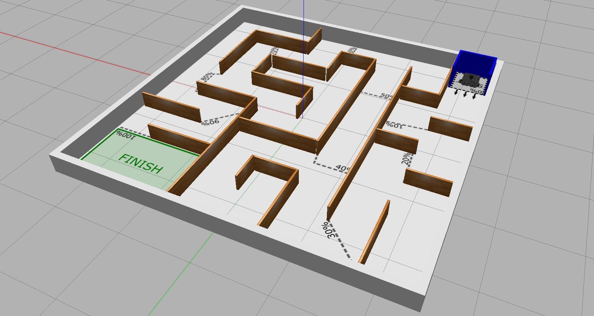
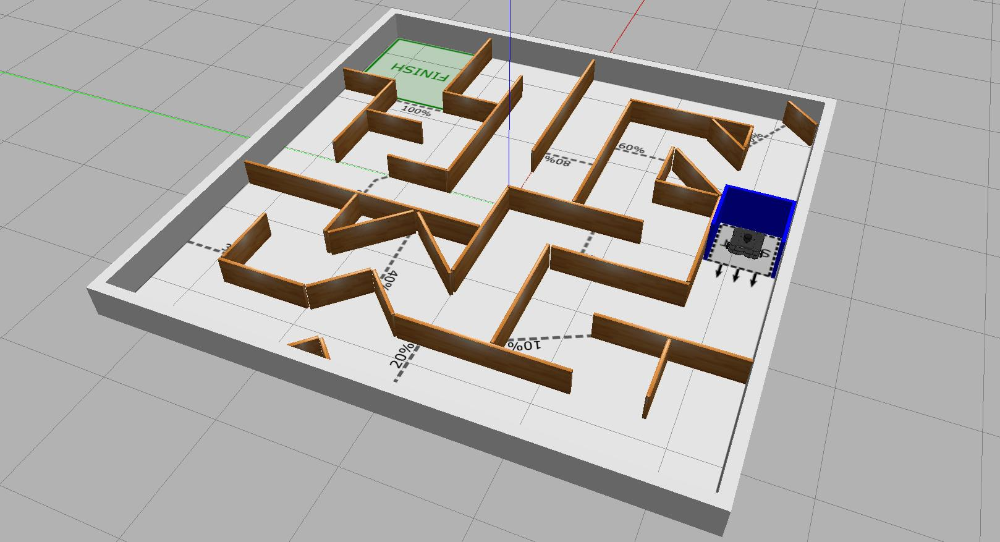

---  
title: "Task 3: Maze Navigation"  
---  

!!! warning "Update (20th March 2024)" 

    This task will now be assessed **in simulation**, NOT on a real robot!

Develop the ROS node(s) to enable a TurtleBot3 Waffle to navigate a maze in 150 seconds or less without crashing into anything.

!!! success "Course Checkpoints"
    
    You should aim to have completed the following *additional* parts of the COM2009 ROS Course to support your work on this task: 

    * **Assignment #1**: Up to and including [Part 5](../../assignment1/part5.md) (in full).
    * **Fact-Finding Missions**:
        * [Mission 1 (Publishing Velocity Commands)](../../../waffles/fact-finding.md#mission-1-publishing-velocity-commands),
        * [Mission 4 (Out of Range LiDAR Data)](../../../waffles/fact-finding.md#mission-4-out-of-range-lidar-data).

## Summary

For this task your robot will need to navigate a maze of corridors without touching the walls.

As with Task 2, the LiDAR sensor will be essential here, this time allowing the robot to detect the maze walls and maintain a safe distance from them. Your robot will need to progress through a maze all the way to the end in order to be awarded maximum marks. The robot's *Odometry System* may prove useful too; allowing it to keep track of where it is and where it has *already been*, so that it continues to progress through the maze and doesn't waste time going back on itself. The maze may contain **dead-ends**, so you'll need to make sure your robot is able to navigate its way out of these and (ideally) not go down the same ones repeatedly!

One common method for solving mazes is to use a [wall following algorithm](https://en.wikipedia.org/wiki/Maze-solving_algorithm#Wall_follower). The maze that the Waffle will need to navigate for this task **won't** contain any islands, i.e. it will be *"simply connected,"* so this is one method you might choose to adopt here. The drawback however, is that you'll need to decide in advance whether to implement a *left-* or *right*-hand wall follower, without knowing what the final maze is going to look like. Depending on the maze configuration, one could prove much less efficient than the other!

## Details

The maze that the robot will need to navigate for this task will ~~span the full 4x4m area of the Computer Room 5 Robot Arena~~ ^^occupy a 5x5m square arena **in a simulated environment**^^. There'll only be wooden walls in the arena for this task though, no other objects. The maze will be constructed to ensure there is always enough space for a TurtleBot3 Waffle to comfortably pass through any apertures or corridors.

1. The robot will start at one end of a maze and must autonomously navigate all the way to the other end (or get as far as possible).
1. The robot must do this *without* touching any of the arena walls, and **penalties will be applied** for those that do (See [the table below](#marks)).
1. The robot's progress will be measured at ~10% increments throughout the maze, using distance markings on the arena floor (the finish line representing 100%).
1. The robot will have a maximum of 150 seconds to navigate the maze. 

    *The 150-second timer will start as soon as the robot starts moving.*

    <a name="launch"></a>

1. Your team's ROS package must contain a launch file called `task3.launch`, such that the functionality that you develop for this maze navigation task can be launched from your package via the command:
  
    ```bash
    roslaunch com2009_team{} task3.launch
    ```
  
    (~~ROS will already be running on the robot before we attempt to execute your launch file on the laptop that the robot has been paired with~~ ^^The robot will have already been launched into the simulated environment before we attempt to execute your launch file^^.)

## Simulation Resources

!!! info 
    Make sure you [check for updates to the Course Repo](../../../extras/tuos-ros.md#updating) to ensure that you have the most up-to-date version of these simulations.

Within the `com2009_simulations` package there are **two example mazes**, which can be launch using `roslaunch` as follows:

=== "Maze Variant A"

    ```bash
    roslaunch com2009_simulations task3.launch
    ```

    <center>
      <figure markdown>
        
        <figcaption>Maze Navigation Arena (Example A)</figcaption>
      </figure>
    </center>

=== "Maze Variant B"
    
    ```bash
    roslaunch com2009_simulations task3b.launch
    ```

    <center>
      <figure markdown>
        
        <figcaption>Maze Navigation Arena (Example B)</figcaption>
      </figure>
    </center>

You can use the above to develop your ROS node(s) for Task 3, but note that **the maze that will be used for the final assessment will be different to the examples!**

## Marking {#marks}

There are **20 marks** available for this task in total, awarded based on the following criteria:

<center>

| Criteria | Marks | Details |
| :--- | :---: | :--- |
| **A**: Progress Through the Maze | 15/20 | Marks will be awarded based on the furthest progress marker that your robot manages to cross within the 150-second time limit. It doesn't matter if the robot happens to turn around and move back behind a marker again at any point during the assessment. Progress markers will represent progress through the maze at 10% increments (approximately). Marks will be awarded at 10% increments only (i.e. no fractional marks), but the **whole of the robot** must have crossed the progress marker in order to be awarded the associated marks (as per [the table below](#progress)).  |
| **B**: An *'incident-free run'* | 5/20 | If the robot completes the task (or the 150 seconds elapses) without it making contact with anything in the arena then your team will be awarded the maximum marks here. Marks will be deducted for each contact that the robot makes with the environment, to a minimum of 0 (i.e. no negative marking will be applied: the minimum mark that you can receive for this is zero). Your robot must *at least* pass the 10% progress marker to be eligible for these marks. Once five incidents have been recorded then the assessment will be stopped. |

</center>

### Criterion A: Progress Through the Maze {#progress}

**Marks:** 15/20

As shown in the table below, for the first half of the maze (up to 50%) one mark will be awarded per progress marker that is passed, and from 60% onwards this increases to **two** marks per progress marker:

<center>

| Progress (%) | Marks |
| :---: | :---: |
|   10  |   1  |
|   20  |   2  |
|   30  |   3  |
|   40  |   4  |
|   50  |   5  |
|   60  | **7** |
|   70  | **9** |
|   80  | **11** |
|   90  | **13** |
|  100  | **15** |

</center>