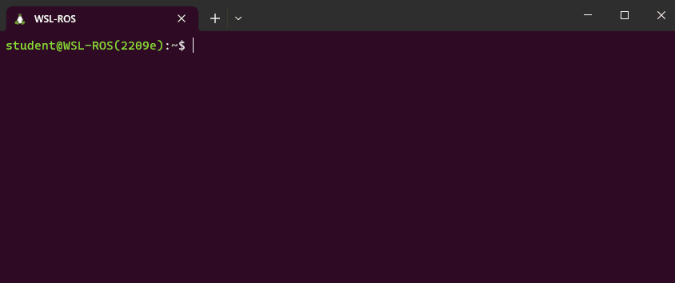

---  
title: "Task 4: Exploration & Search"  
---  

Develop the ROS node(s) that allow a TurtleBot3 Waffle to autonomously explore the full Computer Room 5 robot arena, navigating through a series of rooms as quickly as possible whilst documenting its exploration with a photo of a beacon and a map of the environment as it goes! 

!!! success "Course Checkpoints"
    
    You should aim to have completed the following *additional* parts of the COM2009 ROS Course to support your work on this task: 

    * **Assignment #1**: [All of it](../../assignment1/README.md), *in full!*
    * **Fact-Finding Missions**: [Missions 1-5](../../../waffles/fact-finding.md) (i.e. *all of them!*)

## Summary

For this task the robot arena will contain a series of "rooms" each with a coloured, cylindrical beacon in it. The main aim is to *safely* explore each of the rooms in the shortest time possible (emphasis on *"safely"* here, meaning you need to also try not to crash into anything in the process!) At the same time, you'll need to search for a beacon of a particular colour as well as documenting your exploration by building a map of the environment with SLAM.

## Simulation Resources

Once again, there's a simulation to help you develop your code for this task outside the lab sessions. This also helps to illustrate the nature of the task. You can launch the simulation from the `com2009_simulations` package with the following `roslaunch` command:

```bash
roslaunch com2009_simulations exploration.launch
```

<center>
<figure markdown>
  
  <figcaption>The development arena for Task 4.</figcaption>
</figure>
</center>

!!! info "Remember"
    Make sure you [check for updates to the course repo](../../../extras/tuos-ros.md#updating) to ensure that you have the most up-to-date version of this.

The real robot arena might look something like this for the real assessment, where (similarly to the simulated environment) "rooms" will be constructed of wooden walls 180 mm tall, 10 mm thick and either 440 mm or 880 mm in length, and each room will contain a cylindrical beacon of 200 mm diameter and 250 mm height.

!!! note
    The actual layout of the real robot arena *will be different* to the simulation!

    1. Rooms will be different shapes and sizes and in different locations, but there will always be four of them.
    1. The robot might not necessarily be located at the same starting point as in the simulation.
    1. Beacons will be the same shape, size and colour as those in the simulation (yellow, red, green and blue). Detecting colours is a lot harder in the real-world than it is in simulation though, so you'll need to do a lot of testing on a real robot if you want to get this working robustly (you will have access to all the beacons during the lab sessions).

!!! warning 
    Even if your code works perfectly in simulation, that doesn't mean that it will work in the real world. **Test things thoroughly on the real Waffles as much as possible!**

## Details

The robot will have 3 minutes (180 seconds) in total to complete this task.

1. The arena floor will be marked out with 16 equal-sized zones, and (much like in [Task 2](../parta/task2.md)) you will pick up marks if your robot manages to enter any of the outer 12 of them within the time available.
1. In addition to this, the robot will need to try to explore the four rooms that will also be present in the arena. There will be marks available not only for the *number* of rooms that the robot manages to explore, but also the *speed* at which it manages to explore them all (see [the marking section below](#marking) for more details).
1. Your robot will need to do this whilst minimising the number of contacts made with anything in the environment (*"incidents"*). Once an incident has taken place, we'll move the robot away slightly so that it is free to move again, but after **five** incidents have occurred the assessment will be stopped.
1. Your team's ROS package must contain a launch file named `task4.launch`, such that (for the assessment) we are able to launch all the nodes that you have developed for this task via the following command:
  
    ```bash
    roslaunch com2009_team{} task4.launch
    ```

Having developed the core functionality for the task, you'll then need to think about a couple of more **advanced features**...

### Advanced Feature 1: A photo of a beacon

As with all previous tasks, we will launch the ROS node(s) from within your package for this task using `roslaunch`. For this one however, we will also attempt to supply an additional argument when we make the command-line call:

```bash
roslaunch com2009_team{} task4.launch target_colour:={colour}
```

...where `{colour}` will be replaced with either `yellow`, `red`, `green` or `blue` (the target colour will be selected randomly). Based on this input, your robot will need to capture an image of the beacon in the arena of that colour!

!!! warning "Remember"
    You should know from [this the fact-finding mission](../../../waffles/fact-finding.md#mission2) that the camera image topic name is different on the real robot!

The root of your package directory must contain a directory called `snaps`, and the image must be saved into this directory with the file name: `task4_beacon.jpg`. 

You will therefore need to define your launch file to accommodate the `target_colour` command-line argument. In addition to this, inside your launch file you'll *also* need to pass the *value* of this to a ROS node within your package, so that the node knows which beacon to actually look for (i.e. your node needs to know whether to look for a yellow, red, green or blue beacon). We didn't actually cover this kind of launch file functionality in Assignment #1, but there are a whole load of additional resources available in the [Launch Files](../../../extras/launch-files/README.md) section of this course site, which should help you with this.

<a name="autocomplete"></a>

We will test whether your launch file has been correctly built to accept the `target_colour` command-line argument using *autocomplete* in the terminal. After typing the first four characters of the argument name, i.e.: `targ`, the rest of the name should be completed for us when we press the ++tab++ key, as illustrated below: 

<center>
<figure markdown>
  
</figure>
</center>

<a name="arg_parsing"></a>

To illustrate that the value of the `target_colour` command-line argument has been correctly passed to a ROS Node within your package, you should configure your Task 4 Node (or any one of your nodes, if you have multiple) to print a message to the terminal as soon as it starts. The message should be formatted *exactly* as follows:

```txt
TASK 4 BEACON: The target is {colour}.
```

...where `{colour}` (including the curly brackets!) is replaced with the actual colour that was passed to your `task4.launch` file (`yellow`, `red`, `green` or `blue`). 

### Advanced Feature 2: Mapping with SLAM

Marks are also available if, whilst your robot is completing this task, you can also run SLAM and generate a map of the environment in the background.

In [Assignment #1 Part 3 Exercise 2](../../assignment1/part3.md#ex2) you launched SLAM using the following `roslaunch` command:

```bash
roslaunch turtlebot3_slam turtlebot3_slam.launch
```

Once you've had a look at [the Launch Files section](../../../extras/launch-files/README.md) it should be clear how to launch other launch files from within your own. Alternatively, you could navigate to the `turtlebot3_slam` package in your local ROS installation (or on the robot laptops) to have a look at the content of the launch file that we executed from within this package for Exercise 2, to see how you might be able launch the same (or similar) functionality within your own `task4.launch` file.

When it comes to saving the map that has been generated by SLAM, think about how we did this in [the Part 3 Exercise](../../assignment1/part3.md#ex2). This involved calling a `map_saver` node from the command-line. It's possible, however, to call nodes (and indeed launch files too) from within other ROS nodes using [the ROS Launch Python API](../../../extras/launch-files/roslaunch-api.md).

The root of your package directory must contain a directory called `maps`, and the map file that you obtain must be saved into this directory with the name: `task4_map`.

## Marking

There are **40 marks** available for this task in total, awarded based on the criteria outlined below.

<center>

| Criteria | Marks | Details |
| :--- | :---: | :--- |
| **A**: *Arena* exploration | 8/40 | For this task, the arena will be divided into **nine** equal-sized zones. You will be awarded 1 mark for each zone that your robot manages to enter, excluding the one it starts within. The robot only needs to enter each zone once, but its full body must be inside the zone marking to be awarded the associated mark. |
| **B**: *Room* exploration | 12/40 | Marks will be awarded based on the maximum number of rooms that your robot manages to explore within the 180-second time limit **and** the speed by which it does this. [The marking details are outlined here](#room-explore). |
| **C**: An *'incident-free run'* | 5/40 | Similarly to Task 3, if your robot completes the task (or the 180 seconds elapses) without it making contact with anything in the arena then you will be awarded a full 5 marks for this, with deductions then applied for each unique "incident" (to a minimum of 0/5). Your robot must *at least* leave the zone that it starts in to be eligible for these marks. Once five incidents have been recorded then the assessment will be stopped. |
| **D1**: A Photo of a Beacon | 10/40 | [Further details here](#crit-d1). |
| **D2**: Mapping with SLAM | 5/40 | [Further details here](#crit-d2). | 

</center>

### Criterion B: *Room* exploration {#room-explore}

The marks available per room explored will be awarded as follows:

<center>

| Time (seconds) | 1 room | 2 rooms | 3 rooms | 4 rooms |
|  :---:  | :---: | :---: | :---: | :---: |
| 150-180 |  1.0  |  4.0  |  7.0  |  12.0 |
| 120-149 |  1.5  |  4.5  |  7.5  |  12.0 |
|  90-129 |  2.0  |  5.0  |  8.0  |  12.0 |
|   60-89 |  2.5  |  5.5  |  9.0  |  12.0 |
|     <60 |  3.0  |  6.0  |  9.0  |  12.0 |

</center>

*The 180-second timer will start as soon as the robot starts moving within the arena*.

### Criterion D1: A Photo of a Beacon {#crit-d1}

<center>

| Criteria | Details | Marks|
| :--- | :--- | :--- |
| **D1.a** | Your `task4.launch` file accepts the `target_colour` command line argument (assessed by [checking for autocompletion, as discussed above](#autocomplete)) **and** a message is printed to the terminal to indicate that the **correct** target colour has been passed to a node in your package (this must occur straight away on executing your launch file and [the message format must be exactly as specified here](#arg_parsing)). | 2 |
| **D1.b** | At the end of the assessment a **single** image file, called `task4_beacon.jpg`, has been obtained from the robot's camera (during the course of the assessment), and this is located in a folder called `snaps` at the root of your package directory i.e.: `com2009_team{}/snaps/task4_beacon.jpg`. | 2 | 
| **D1.c** | Your `com2009_team{}/snaps/task4_beacon.jpg` image file contains **any part** of the **correct** beacon. | 3 |
| **D1.d** | Your `com2009_team{}/snaps/task4_beacon.jpg` image file contains the correct beacon, where the **entire width** of the beacon can be observed. | 3 |

</center>

### Criterion D2: Mapping with SLAM {#crit-d2}  

<center>

| Criteria | Details | Marks|
| :--- | :--- | :--- |
| **D2.a** | By the end of the assessment a map of the robot arena (or any part of it) must have been generated. Two files should exist: a `.pgm` and a `.yaml`, both of which must be called `task4_map`, and both must be located in a `maps` folder at the root of your package directory i.e. `com2009_team{}/maps/task4_map.pgm` and `com2009_team{}/maps/task4_map.yaml`. | 2 |
| **D2.b** | Your `com2009_team{}/maps/task4_map.pgm` map that is created *during the assessment* depicts **at least one** of the rooms in the arena. | 3 |   

</center>