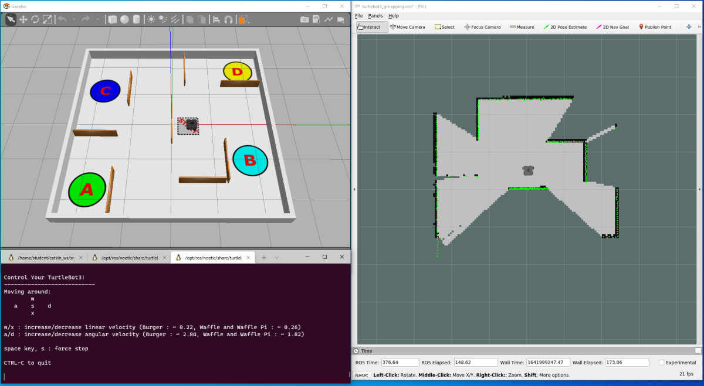
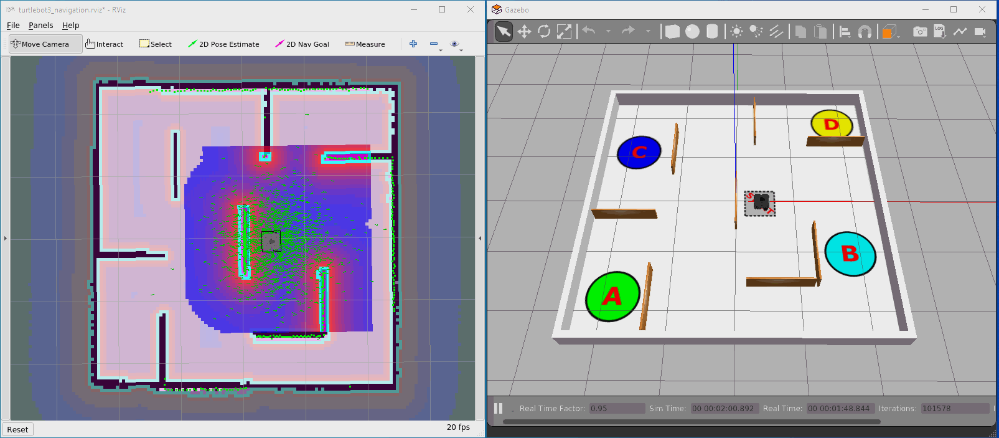

---  
title: "Week 3: Advanced Navigation & SLAM"  
subtitle: Implement odometry-based velocity control to make a robot follow a pre-defined motion path. Explore the LiDAR sensor, how the data form this device can be of huge benefit for robotics applications, and see this in practice by leveraging the autonomous navigation (and mapping) tools within ROS.
---

!!! info
    You should be able to complete Exercises 2, 3, & 4 on this page within a two-hour lab session, but you may want to spend a bit more time on Exercise 1.

## Introduction

### Aims

This week you will implement *closed-loop velocity control* and create a ROS node that can control a robot's motion path by using odometry data as a feedback signal. In doing this however, you will start to appreciate the limitations of odometry as a feedback signal, which will lead us on to exploring some other data-streams that could be used to aid navigation further. Finally, you will leverage some existing ROS libraries and TurtleBot3 packages to explore some of the *autonomous navigation* methods that are available within ROS.

### Intended Learning Outcomes

By the end of this session you will be able to:

1. Combine both publisher *&* subscriber communication methods (that you have so far dealt with in isolation) into a single Python node to implement closed-loop (odometry-based) velocity control of a robot.
1. Explain the limitations of Odometry-based motion control methods. 
1. Interpret the data that is published to the `/scan` topic and use existing ROS tools to visualise this.
1. Use existing ROS tools to implement SLAM and build a map of an environment. 
1. Leverage existing ROS libraries to make a robot navigate an environment *autonomously*, using the map that you have generated.
1. Explain how these SLAM and Navigation tools are implemented and what information is required in order to make them work.

### Quick Links

* [Exercise 1: Make your robot follow a Square motion path](#ex1)
* [Exercise 2: Using RViz to Visualise Robot Data](#ex2)
* [Exercise 3: Building a map of an environment with SLAM](#ex3)
* [Exercise 4: Navigating an Environment Autonomously](#ex4)

### Additional Resources

* [The `move_square` Template (for Exercise 1)](move_square)

## Getting Started

**Step 1: Launch WSL-ROS**  
Launch your WSL-ROS environment by running the WSL-ROS shortcut in the Windows Start Menu (if you haven't already done so). Once installed, the *Windows Terminal* app should launch with an *Ubuntu terminal instance* ready to go (**TERMINAL 1**).

**Step 2: Restore your work**  
Remember that any work that you do in WSL-ROS will not be preserved between sessions or across different University computers. You should have used the `wsl_ros` tool at the end of the previous session to back up your home directory to your University U: Drive. If so, then you should now be prompted to restore it:

<figure markdown>
  {width="600"}
</figure>

Enter `Y` to restore your work now.

??? tip
    You can also use the `wsl_ros restore` command to restore your work at any other time.

**Step 3: Launch VS Code**  
Also launch VS Code now by [following the steps here to launch it correctly within the WSL-ROS environment](../../../wsl-ros/vscode).

**Step 4: Launch the Robot Simulation** 
You should know exactly how to do this now but, just to re-iterate, enter the following into **TERMINAL 1**:
        
***
**TERMINAL 1:**
```bash
roslaunch turtlebot3_gazebo turtlebot3_empty_world.launch
```
***

...which will launch a Gazebo simulation of a TurtleBot3 Waffle in an empty world:

<figure markdown>
  
</figure>

??? tip
    Getting bored with entering that long command to launch the simulation? You could use a command *alias* instead:

    ```bash
    tb3_empty_world
    ```

## Odometry-based Navigation

In the previous session you created [a Python node to make your robot move using *open-loop control*](../week2/#ex4). To achieve this you published velocity commands to the `/cmd_vel` topic to make the robot follow a circular motion path.

!!! note "Questions"
    * How do you know if your robot actually achieved the motion path that you were hoping for?
    * In a real-world environment, what external factors might result in your robot *not* achieving its desired trajectory?

Last week you also learnt about [Robot Odometry](../week2/#odometry), which is used by the robot to keep track of its **position** and **orientation** (aka **Pose**) in the environment.  This is determined by a process called *"dead-reckoning,"* which is only really an approximation, but it's a fairly good one in any case, and we can use this as a feedback signal to understand if our robot is moving in the way that we expect it to.  We can therefore build on the techniques that we used in the `move_circle.py` node from last time, and now also build in the ability to *subscribe* to a topic too. In this case, we'll be subscribing to the `/odom` topic that we worked with a bit (in isolation) last time, and use this to provide us with a feedback signal to allow us to implement some basic *closed-loop control*.

#### :material-pen: Exercise 1: Make your robot follow a Square motion path {#ex1}

1. Launch a new terminal instance (**TERMINAL 2**) and, from there, navigate to the `week2_navigation` package that you created last time[^roscd].
    
    [^roscd]: Hint: You can use the `roscd` command for this!
    
1. Navigate to the package `src` directory and use the Linux `touch` command to create a new file called `move_square.py`:
    
    ***
    **TERMINAL 2:**
    ```bash
    touch move_square.py
    ```
    ***

1. Then make this file executable using `chmod`:

    ***
    **TERMINAL 2:**
    ```bash
    chmod +x move_square.py
    ```
    ***

1. Use the VS Code File Explorer to navigate to this `move_square.py` file and open it up, ready for editing.
1. [There's a template here to help you with this exercise](move_square). Copy and paste the template code into your new `move_square.py` file to get you started.
1. Run the code as it is to see what happens...

    !!! warning "Fill in the Blank!"
        Something not quite working as expected? We may have missed out [something very crucial](../week1/subscriber/#dfts) on **the very first line** of the code template, can you work out what it is?!

1. Fill in the blank as required and then adapt the code to make your robot follow a **square motion path** of **1m x 1m** dimensions:
    * The robot's odometry will tell you how much the robot has moved and/or rotated, and so you should use this information to achieve the desired motion path. 
    * Your Python node will therefore need to *subscribe* to the `/odom` topic as well as *publish* to `/cmd_vel`.

**Advanced features:**

1. Adapt the node further to make the robot automatically stop once it has performed two complete loops.
1. Create a launch file to launch this *and* the `odom_subscriber.py` node from last time simultaneously!

After following a square motion path a few times, your robot *should* return to the same location that it started from.

## Laser Displacement Data and The LiDAR Sensor {#lidar}

Odometry is really important for robot navigation, but it can be subject to drift and accumulated error over time. You may have observed this in the previous exercise, but you would most certainly notice it if you were to do the same on a real robot. Fortunately, we have another sensor on-board our robot which provides even richer information about the environment, and we can use this to supplement the odometry information and enhance the robot's navigation capabilities.

#### :material-pen: Exercise 2: Using RViz to Visualise Robot Data {#ex2}

<a name="rviz"></a>We're going to place the robot in a more interesting environment now, so you'll need to make sure that you close down the Gazebo simulation that is currently running.  The best way to do this is to go to **TERMINAL 1** and enter `Ctrl+C`.  It may take a bit of time, but the Gazebo window will close down after 30 seconds or so. You should also stop your `move_square.py` node, if that's still running too. 

1. Return to **TERMINAL 1** and enter the following to launch a new simulation:

    ***
    **TERMINAL 1:**
    ```bash
    roslaunch turtlebot3_gazebo turtlebot3_world.launch
    ```
    ***

    A new Gazebo simulation should now be launched with a TurtleBot3 Waffle in a new environment:

    <figure markdown>
      
    </figure>

1. In **TERMINAL 2**, enter the following:

    ***
    **TERMINAL 2:**
    ```bash
    roslaunch tuos_ros_simulations rviz.launch
    ```
    ***
    
    On running the command a new window should open:

    <figure markdown>
      
    </figure>

    This is *RViz*, which is a ROS tool that allows us to *visualise* the data being measured by a robot in real-time. The red dots scattered around the robot represent *laser displacement data* which is measured by the LiDAR sensor located on the top of the robot.  This data allows the robot to measure the distance to any obstacles in its immediate surroundings. The LiDAR sensor spins continuously, sending out laser pulses as it does so. These laser pulses then bounce off any objects and are reflected back to the sensor. Distance can then be determined based on the time it takes for the pulses to complete the full journey (from the sensor, to the object, and back again), by a process called *"time of flight"*. Because the LiDAR sensor spins and performs this process continuously, a full 360&deg; scan of the environment can be generated.  In this case (because we are working in simulation here) the data represents the objects surrounding the robot in its *simulated environment*, so you should notice that the red dots produce an outline that resembles the objects in the world that is being simulated in Gazebo (or partially at least).
    
1. Next, open up a new terminal instance (**TERMINAL 3**). Laser displacement data from the LiDAR sensor is published by the robot to the `/scan` topic. We can use the `rostopic info` command to find out more about the nodes that are publishing and subscribing to this topic, as well as the message *type*:

    ***
    **TERMINAL 3:**
    ```bash
    rostopic info /scan
    ```
    ```txt
    Type: sensor_msgs/LaserScan

    Publishers:
        * /gazebo (http://localhost:#####/)

    Subscribers:
        * /rviz_#### (http://localhost:#####/) 
    ```
    ***

1. As we can see from above, `/scan` messages are of the `sensor_msgs/LaserScan` type, and we can find out more about this message type using the `rosmsg info` command:

    ***
    **TERMINAL 3:**
    ```bash
    rosmsg info sensor_msgs/LaserScan
    ```
    ```txt
    std_msgs/Header header
      uint32 seq
      time stamp
      string frame_id
    float32 angle_min
    float32 angle_max
    float32 angle_increment
    float32 time_increment
    float32 scan_time
    float32 range_min
    float32 range_max
    float32[] ranges
    float32[] intensities 
    ```
    ***

### Interpreting `/LaserScan` Data

The `LaserScan` message is a standardised ROS message (from the `sensor_msgs` package) that any ROS Robot can use to publish data that it obtains from a Laser Displacement Sensor such as the LiDAR on the TurtleBot3.  You can find the full definition of the message [here](http://docs.ros.org/en/noetic/api/sensor_msgs/html/msg/LaserScan.html). *Have a look at this to find out more.*

`ranges` is an array of `float32` values (we know it's an *array* of values because of the `[]` after the data-type). This is the part of the message containing all the *actual distance measurements* that are being obtained by the LiDAR sensor (in meters).

<a name="fig_lidar"></a>Consider a simplified example here, taken from a TurtleBot3 robot in a much smaller, fully enclosed environment.  In this case, the displacement data from the `ranges` array is represented by green squares:

<figure markdown>
  
</figure>

<a name="echo_scan_variables"></a>As illustrated in the figure, we can associate each data-point within the `ranges` array to an *angular position* by using the `angle_min`, `angle_max` and `angle_increment` values that are also provided within the `LaserScan` message.  We can use the `rostopic echo` command to drill down into these elements of the message specifically and find out what their values are:

```txt
$ rostopic echo /scan/angle_min -n1
0.0
```
```txt
$ rostopic echo /scan/angle_max -n1
6.28318977356
```
```txt
$ rostopic echo /scan/angle_increment -n1
0.0175019223243
```

Notice how we were able to access *specific variables* within the `/scan` message using `rostopic echo` here, rather than simply printing the whole thing?

!!! note "Questions"
    * What does the `-n1` option do, and why is it appropriate to use this here?
    * What do these values represent? (Compare them with [the figure above](#fig_lidar))

The `ranges` array contains 360 values in total, i.e. a distance measurement at every 1&deg; (an `angle_increment` of 0.0175 radians) around the robot. The first value in the `ranges` array (`ranges[0]`) is the distance to the nearest object directly in front of the robot (i.e. at &theta; = 0 radians, or `angle_min`). The last value in the `ranges` array (`ranges[359]`) is the distance to the nearest object at 359&deg; (i.e. &theta; = 6.283 radians, or `angle_max`) from the front of the robot. If, for example, we were to obtain the 65th value in the `ranges` array, that is: `ranges[65]`, we know that this would represent the distance to the nearest object at an angle of 65&deg; (1.138 radians) from the front of the robot (anti-clockwise), as shown in [the figure](#fig_lidar).

<a name="range_max_min"></a>The `LaserScan` message also contains the parameters `range_min` and `range_max`, which represent the *minimum* and *maximum* distance (in meters) that the LiDAR sensor can detect, respectively. You can use the `rostopic echo` command to report these directly too.  

!!! note "Question"
    What *is* the maximum and minimum range of the LiDAR sensor? Use [the same technique as we used above](#echo_scan_variables) to find out.

Finally, use the `rostopic echo` command again to display the `ranges` portion of the `LaserScan` topic message.  Don't use the `-n1` option now, so that you can see the data changing, in the terminal, in real-time, but use the `-c` option to clear the screen after every message to make things a bit clearer.  You might also need to maximise the terminal window so that you can see the full content of the array (all 360 values!) The array is quite big, but is bound by square brackets `[]` to denote the start and end, and there should be a `---` at the end of each message too, to help you confirm that you are viewing the entire thing.

The main thing you'll notice here is that there's way too much information, updating far too quickly for it to be of any real use! As you have already seen though, it is the numbers that are flying by here that are represented by red dots in RViz.  Head back to the RViz screen to have another look at this now. As you'll no doubt agree, this is a much more useful way to visualise the `ranges` data, and illustrates how useful RViz can be for interpreting what your robot can *see* in real-time.

What you may also notice is several `inf` values scattered around the array.  This represents sensor readings that were *greater than* the distance specified by `range_max`, so the sensor couldn't report a distance measurement in these cases. 

Stop the `rostopic echo` command from running in the terminal window by entering `Ctrl+C`.

## Simultaneous Localisation and Mapping (SLAM) {#slam}

In combination, the data from the LiDAR sensor and the robot's odometry (the robot *pose* specifically) are really powerful, and allow some very useful conclusions to be made about the its environment.  One of the key applications of this data is *"Simultaneous Localisation and Mapping"*, or *SLAM*.  This is a tool that is built into ROS, allowing a robot to build up a map of its environment and locate itself within that map at the same time!  You will now learn how easy it is to leverage this in ROS.

#### :material-pen: Exercise 3: Building a map of an environment with SLAM {#ex3}

1. Close down all ROS processes that are running now by entering `Ctrl+C` in each terminal:
    1. The Gazebo processes in **TERMINAL 1**.
    1. The RViz processes running in **TERMINAL 2**.

1. We're going to launch our robot into *another* new simulated environment now, which we'll be creating a map of using SLAM! To launch the simulation enter the following command in **TERMINAL 1**:

    ***
    **TERMINAL 1:**
    ```bash
    roslaunch tuos_ros_simulations nav_world.launch
    ```
    ***

    The environment that launches should look like this:

    <figure markdown>
      
    </figure>

1. Now we will launch SLAM to start building a map of this environment. In **TERMINAL 2**, launch SLAM as follows:
        
    ***
    **TERMINAL 2:**
    ```bash
    roslaunch turtlebot3_slam turtlebot3_slam.launch
    ```
    ***

    This will launch RViz again, and you should be able to see a model of your TurtleBot3 from a top-down view, this time with green dots representing the real-time LiDAR data. The SLAM tools will already have begun processing this data to start building a map of the boundaries that are currently visible to your robot based on its position in the environment.

1. In **TERMINAL 3** launch the `turtlebot3_teleop` node ([you should know how to do this by now](../week2/#teleop)).  Re-arrange and re-size your windows so that you can see Gazebo, RViz *and* the `turtlebot3_teleop` terminal instance all at the same time:
    
    <figure markdown>
      
    </figure>

1. Drive the robot around the arena slowly, using the `turtlebot3_teleop` node, and observe the map being updated in the RViz window as you do so. Drive the robot around until a full map of the environment has been generated.
    
    <figure markdown>
      
    </figure>

1. As you're doing this you need to *also* determine the centre coordinates of the four circles (A, B, C & D) that are printed on the arena floor. Drive your robot into each of these circular zones and stop the robot inside them. As you should remember from last time, we can determine the position (and orientation) of a robot in its environment from its *odometery*, as published to the `/odom` topic. In [Exercise 2 last time](../week2/#ex2) you built an odometry subscriber node, so you could launch this now, in **TERMINAL 4**, and use this to inform you of your robot's `x` and `y` position in the environment when located within each of the zone markers:

    ***
    **TERMINAL 4:**
    ```bash
    rosrun week2_navigation odom_subscriber.py
    ```
    ***

    <a name="goal_coords"></a>Record the zone marker coordinates in a table such as the one below (you'll need this information for the next exercise).

    <center>

    | Zone | X Position (m) | Y Position (m) |
    | :---: | :---: | :---: |
    | START | 0.5   | -0.04 |
    | A     |       |       |
    | B     |       |       |
    | C     |       |       |
    | D     |       |       |

    </center>

1. Once you have obtained all this data, and you're happy that your robot has built a complete map of the environment, you then need to save this map for later use. We do this using a ROS `map_server` package.  First, stop the robot by pressing `S` in **TERMINAL 3** and then enter `Ctrl+C` to shut down the `turtlebot3_teleop` node.
1. Then, remaining in **TERMINAL 3**, navigate to the root of your `week2_navigation` package directory and create a new folder in it called `maps`:

    ***
    **TERMINAL 3:**
    ```bash
    roscd week2_navigation
    mkdir maps
    ```
    ***

1. Navigate into this new directory:

    ***
    **TERMINAL 3:**
    ```bash
    cd maps/
    ```
    ***
    
1. Then, run the `map_saver` node from the `map_server` package to save a copy of your map:

    ***
    **TERMINAL 3:**
    ```bash
    rosrun map_server map_saver -f {map name}
    ```
    Replacing `{map name}` with a name of your choosing. 
    ***

    This will create two files: a `{map name}.pgm` and a `{map name}.yaml` file, both of which contain data related to the map that you have just created.  The `.pgm` file contains an *Occupancy Grid Map (OGM)*, which is used for *autonomous navigation* in ROS.  Have a look at the map by launching it in an Image Viewer Application called `eog`:
    
    ***
    **TERMINAL 3:**
    ```bash
    eog {map name}.pgm
    ```
    ***

    A new window should launch containing the map you have just created with SLAM and the `map_saver` node: 
    
    <figure markdown>
      
    </figure>

    White regions represent the area that your robot has determined is open space and that it can freely move within.  Black regions, on the other hand, represent boundaries or objects that have been detected.  Any grey area on the map represents regions that remain unexplored, or that were inaccessible to the robot.
    
1. Compare the map generated by SLAM to the real simulated environment. In a simulated environment this process should be pretty accurate, and the map should represent the simulated environment very well (unless you didn't allow your robot to travel around and see the whole thing!)  In a real environment this is often not the case.  

    !!! note "Questions"
        * How accurately did your robot map the environment?
        * What might impact this when working in a real-world environment?
    
1. Close the image using the `x` button on the right-hand-side of the *eog* window.

**Summary of SLAM:**

See how easy it was to map an environment in the previous exercise? This works just as well on a real robot in a real environment too (see [this video demonstration that we put together a while back](https://digitalmedia.sheffield.ac.uk/media/An%20Introduction%20to%20ROS%20and%20the%20TurtleBot3%20Waffle/1_32z1rqhk)). 

This illustrates the power of ROS: having access to tools such as SLAM, which are built into the ROS framework, makes it really quick and easy for a robotics engineer to start developing robotic applications on top of this. Our job was made even easier here since we used some packages that had been pre-made by the manufacturers of our TurtleBot3 Robots to help us launch SLAM with the right configurations for our exact robot.  If you were developing a robot yourself, or working with a different type of robot, then you might need to do a bit more work in setting up and tuning the SLAM tools to make it work for your own application.

## Advanced Navigation Methods

As mentioned above, the map that you created in the previous exercise can now be used by ROS to autonomously navigate the mapped area.  We'll explore this now.

#### :material-pen: Exercise 4: Navigating an Environment Autonomously {#ex4}

1. Close down all ROS processes again now so that nothing is running (but leave all three terminal windows open).
1. In order to perform autonomous navigation we now need to activate a number of ROS libraries, our simulated environment and *also* specify some custom parameters, such as the location of our map file. The easiest way to do all of this in one go is to create a launch file. 
1. You may have already created a launch directory in your `week2_navigation` package, but if you haven't then do this now:

    ***
    **TERMINAL 1:**
    ```bash
    roscd week2_navigation
    mkdir launch
    ```
    ***

1. Next, navigate into this directory and create a new file called `navigation.launch`:

    ***
    **TERMINAL 1:**
    ```bash
    cd launch/
    touch navigation.launch
    ```
    ***

1. Open up this file in VS Code and copy and paste the following content: <a name="launch_file"></a>

    ```xml
    --8<-- "code/nav.launch"
    ```

1. Edit the default values in the `To be modified` section:

    ```xml
    <!-- To be modified -->
    <arg name="map_file" default=" $(find week2_navigation)/maps/{map name}.yaml"/>
    <arg name="initial_pose_x" default="0.0"/>
    <arg name="initial_pose_y" default="0.0"/>
    ```

    1. Change `{map name}` to the name of *your map file* as created in the previous exercise (remove the `{}`s!).
    1. Change the `initial_pose_x` and `initial_pose_y` default values. Current these are both set to `"0.0"`, but they need to be set to match the coordinates of the start zone of the `tuos_ros_simulations/nav_world` environment (we may have given you a clue about these in the table earlier!) 

1. Once you've made these changes, save the file and then launch it:

    ***
    **TERMINAL 1:**
    ```bash
    {BLANK} week2_navigation navigation.launch
    ```
    ***

    !!! warning "Fill in the Blank!"
        Which ROS command do we use to execute launch files?
    
1. RViz and Gazebo should be launched, both windows looking something like this:

    <figure markdown>
      
    </figure>

    !!! note "Question"
        How many nodes were actually launched on our ROS Network by executing this launch file?
    
    As shown in the figure, in RViz you should see the map that you generated with SLAM earlier.

    * There should be a "heatmap" surrounding your robot and a lot of green arrows scattered all over the place. 
    * The green arrows represent the *localisation particle cloud*, and the fact that these are all scattered across quite a wide area at the moment indicates that there is currently a great deal of uncertainty about the actual robot pose within the environment. Once we start moving around, this will improve and the arrows will start to converge more closely around the robot. 
        
        This is actually called a *"costmap"*, and it illustrates what the robot perceives of its environment: blue regions representing safe space that it can move around in; red regions representing areas where it could collide with an obstacle.

    * Finally, the green dots illustrate the real-time `LaserScan` data coming from the LiDAR sensor, as we saw earlier. This should be nicely overlaid on top of the boundaries in our map.

1. To send a navigation goal to our robot we need to issue a request to the *move_base action server*. We will cover *ROS Actions* later in this course, but for now, all you really need to know is that we can send a navigation *goal* by publishing a message to a topic on the ROS network. In **TERMINAL 2** run `rostopic list` and filter this to show only topics related to `/move_base`:

    ***
    **TERMINAL 2:**
    ```bash
    rostopic list | grep /move_base
    ```
    This will provide quite a long list, but right at the bottom you should see the following item:
    ```txt
    /move_base_simple/goal
    ```
    ***
    We will use this to publish navigation goals to our robot to make it move autonomously using the ROS Navigation Stack.

1. Running `rostopic info` on this topic will allow us to find out more about it:

    ***
    **TERMINAL 2:**
    ```bash
    rostopic info move_base_simple/goal
    ```
    ```txt
    Type: geometry_msgs/PoseStamped

    Publishers:
      * /rviz (http://localhost:#####/)

    Subscribers:
      * /move_base (http://localhost:#####/)
      * /rviz (http://localhost:#####/)
    ```
    ***

    !!! note "Question"
        What type of message does this topic use, and which ROS package does it live within?
    
1. Run another command now to find out what the structure of this message is (you did this earlier for the `LaserScan` messages published to the `/scan` topic).

1. Knowing all this information now, we can use the `rostopic pub` command to issue a navigation goal to our robot, via the `/move_base_simple/goal` topic. This command works exactly the same way as it did when we [published messages to the `/cmd_vel` topic last week](../week2/#rostopic_pub) (when we made the robot move at a velocity of our choosing).

    Remember that the `rostopic pub` command takes the following format:

    ```txt
    rostopic pub {topic_name} {message_type} {data}
    ```

    ...but to make life easier, we can use the autocomplete functionality in our terminal to help us format the message correctly:

    ```txt
    rostopic pub {topic_name} {message_type}[SPACE][TAB]
    ```

    Do this now, (replacing `{topic_name}` and `{message_type}` accordingly) to generate the full message structure that we will use to send the navigation goal to the robot, from the terminal. *Don't press `Enter` yet though, as we will need to edit the message data in order to provide a valid navigation goal.*

1. There are **four** things in this message that need to be changed before we can publish it:
    1. `frame_id: ''` should be changed to `frame_id: 'map'`
    1. The `pose.orientation.w` value needs to be changed to `1.0`:

        ```txt
        pose:
          orientation:
            w: 1.0
        ```

    1. The `pose.position.x` and `pose.position.y` parameters define the location, in the environment, that we want the robot to move to, [as determined in the previous exercise](#goal_coords):

        ```txt
        pose:
          position:
            x: {desired location in x}
            y: {desired location in y}
        ```

        Scroll back through the message using the left arrow key on your keyboard (&larr;), and modify the four parameters of the message accordingly, setting your `x` and `y` coordinates to make the robot move to any of the four marker zones in the environment.

1. Once you're happy, hit `Enter` and watch the robot move on its own to the location that you specified!

    <figure markdown>
      {width=700px}
    </figure>

    Notice how the green particle cloud arrows very quickly converge around the robot as it moves around? This is because the robot is becoming more certain of it's pose (its position and orientation) within the environment as it compares the boundaries its LiDAR sensor can actually see with the boundaries marked out in the map that you supplied to it.

1. Have a go at requesting more goals by issuing further commands in the terminal (using `rostopic pub`) to make the robot move between each of the four zone markers.

**Summary:**

We have just made a robot move by issuing navigation goal requests to an *Action Server* on our ROS Network. You will learn more about ROS Actions in [Week 5](../week5), where you will start to understand how this communication method actually works. You will also learn how to create *Action Client Nodes* in Python, so that - in theory - everything that you have been doing on the command-line in this exercise could be done programmatically instead.

As you have observed in this exercise, in order to use ROS navigation tools to make a robot move autonomously around an environment there are a few important things that we need to provide to the Navigation Stack:

1. **A map of the environment that we want to navigate around**.  
    This means that our robot needs to have already explored the environment once beforehand to know what the environment actually looks like. We drove our robot around manually in this case but, often, some sort of basic exploratory behaviour would be required in the first instance so that the robot can safely move around and create a map (using SLAM) without crashing into things! You will learn more about robotic search/exploration strategies in your lectures.
1. **The robot's initial location within the environment**.  
    ...so that it could compare the map file that we supplied to it with what it actually observes in the environment. If we didn't know where the robot was to begin with, then some further exploration would be required to start with, in order for the robot to build confidence in its actual pose in the environment, prior to navigating it.
1. **The coordinates of the places we want to navigate to**.  
    This may seem obvious, but it's an extra thing that we need to establish before we are able to navigate autonomously.

## Further Reading

The [ROS Robot Programming eBook that we have mentioned previously](../../../about/robots/#ebook) goes into more detail on how SLAM and the autonomous navigation tools that you have just implemented actually work.  There is information in here on how these tools have been configured to work with the TurtleBot3 robots specifically.  We therefore *highly recommend* that you download this book and have a read of it.  You should read through Chapters 11.3 ("SLAM Application") and 11.4 ("SLAM Theory") in particular, and pay particular attention to the following:  

* What information is required for SLAM? One of these bits of information may be new to you: how does this relate to *Odometry*, which you *do* know about? (See Section 11.3.4)
* Which nodes are active in the SLAM process and what do they do?  What topics are published and what type of messages do they use?  How does the information flow between the node network?
* Which SLAM method did we use? What parameters had to be configured for our TurtleBot3 Waffle specifically, and what do all these parameters actually do?
* What are the *5 steps* in the iterative process of pose estimation? 

We would also recommend you read Chapter 11.7 ("Navigation Theory") too, which should allow you to then answer the following:

* What is the algorithm that is used to perform pose estimation?
* What process is used for trajectory planning? 
* How many nodes do we need to launch to activate the full navigation functionality on our ROS Network? (We asked you this earlier, and the best way to determine it might be to do it experimentally, i.e.: using the `rosnode` command-line tool perhaps?)!

## Wrapping Up

This week you have learnt how to develop an odometry-based controller to make your robot follow a square motion path.  You will likely have observed some degree of error in this which, as you already know, could be due to the fact that Odometry data is determined by dead-reckoning and is therefore subject to drift and error.  Consider how other factors may impact the accuracy of control too:

* How might the rate at which the odometry data is sampled play a role?
* How quickly can your robot receive new velocity commands, and how quickly can it respond?

Be aware that we did all this in simulation here too. In fact, in a real world environment, this type of navigation might be *less effective*, since things such as measurement noise and calibration errors can also have considerable impact.  You will have the opportunity to experience this first hand later in this course.

Ultimately then, we have seen a requirement here for additional information to provide more confidence of a robot's location in its environment, in order to enhance its ability to navigate effectively and avoid crashing into things!

You therefore also learnt about the LiDAR sensor today, and the information that can be obtained from it.  We explored where this data is published, how we access it, and what it tells us about a robot's immediate environment.  We then looked at some ways odometry and laser displacement data can be combined to perform advanced robotic functions such as the mapping of an environment and the subsequent navigation around it. This is all complicated stuff but, using ROS, we can leverage these tools with relative ease, which illustrates just how powerful this framework can be for developing robotic applications quickly and effectively without having to re-invent the wheel!
    
### Saving your work {#backup}

Remember, the work you have done in the WSL-ROS environment during this session **will not be preserved** for future sessions or across different University machines automatically! To save the work you have done here today you should now run the following script in any idle WSL-ROS Terminal Instance:

```bash
wsl_ros backup
```

This will export your home directory to your University U: Drive, allowing you to restore it at the start of the next session.