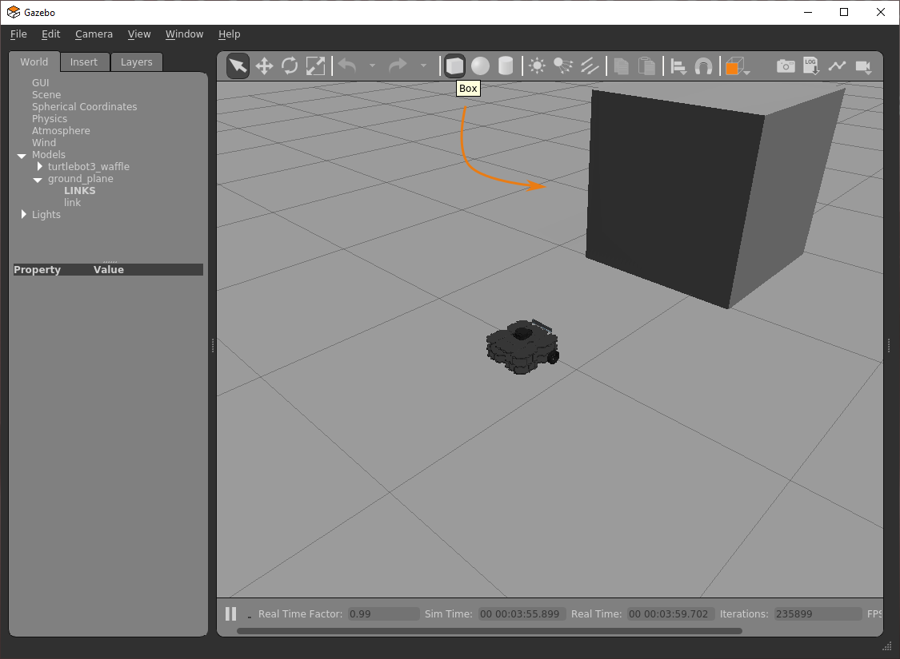

---  
title: "Week 4: ROS Services"  
description: "Here, you'll learn how ROS Services can be used in combination with the standard publisher/subscriber principles that you already know about, to control a robot more effectively for certain operations."  
---

!!! info
    You should be able to complete **most** of the exercises on this page within a two-hour lab session, but you might need to spend a bit more time on the final exercise.

## Introduction

### Aims

In this session you will learn about another communication method that can be used to transmit data/information and invoke actions across a ROS Network: ROS *Services*. You will learn how ROS Services can be used in combination with the standard publisher/subscriber principles that you already know about to control a robot more effectively for certain operations.

### Intended Learning Outcomes

By the end of this session you will be able to:

1. Recognise how ROS Services differ from the standard topic-based publisher-subscriber approach, and identify appropriate use-cases for this type of messaging system.
1. Implement Python node pairs to observe services in action, and understand how they work.
1. Invoke different services using a range of service message types.
1. Develop Python Service nodes of your own to perform specific robotic tasks.
1. Harness Services, in combination with LiDAR data, to implement a basic obstacle avoidance behaviour.
1. Demonstrate your understanding of ROS so far by developing a Python node which incorporates elements from this and previous parts of this course.

### Quick Links

* [Exercise 1: Creating a Service *Server* in Python and calling it from the command-line](#ex1)
* [Exercise 2: Creating a Python Service *Client* Node](#ex2)
* [Exercise 3: Making and calling your own Service](#ex3)
* [Exercise 4: Approaching an object using a Service and closed-loop control](#ex4)

### Additional Resources

* [The Service Server Code (for Exercise 1)](move_server)
* [The Service Client Code (for Exercise 2)](move_client)
* [Creating a `/scan` Callback Function](scan_callback)

## Getting Started

**Step 1: Launch WSL-ROS**  
Launch your WSL-ROS environment by running the WSL-ROS shortcut in the Windows Start Menu (if you haven't already done so). Once installed, the *Windows Terminal* app should launch with an *Ubuntu terminal instance* ready to go (**TERMINAL 1**).

**Step 2: Restore your work**  
When prompted (in **TERMINAL 1**), enter `Y` to restore your work from last time[^1].

[^1]: Remember: you can also use the `wsl_ros restore` command at any time.

**Step 3: Launch VS Code**  
Follow [these steps](../../../wsl-ros/vscode) to launch VS Code correctly within the WSL-ROS environment.

**Step 4: Launch the Robot Simulation**  
From **TERMINAL 1**, launch the TurtleBot3 Waffle *"Empty World"* simulation:

***
**TERMINAL 1:**
```bash
roslaunch turtlebot3_gazebo turtlebot3_empty_world.launch
```
...and then wait for the Gazebo window to open:

<figure markdown>
  {width=800px}
</figure>

??? tip "Remember"
    You can also use the `tb3_empty_world` command-line alias to launch the simulation, rather than using that long `roslaunch` command!

## An Introduction to Services

So far, we've learnt about ROS *topics* and *messages*, and how individual nodes can access data on a robot by simply *subscribing* to topics that are being published by any other node on the system.  In addition to this, we also learnt how any node can *publish* messages to any topic: this essentially broadcasts the data contained in the message across the ROS Network, making it available to any other node on the network that may wish to access it.

Another way to pass data between ROS Nodes is by using *Services*.  These are different to messages in that *"Service calls"* (that is, the process of requesting a service) occur *only* between one node and another:

1. One node (a Service *Client*) sends a **Request** to another node.
1. Another node (a Service *Server*) processes that request, performs an action and then sends back a **Response**.

<figure markdown>
  
</figure>

Services are *Synchronous* (or *sequential*): When a ROS node sends a request to a service (as a Service *Client*) it can't do anything else until the service has been completed and the Service *Server* has sent a response back. This can be useful for a variety of reasons:

* **Discrete, short-duration actions:**

    * A robot might need to do something before it can move on to something else, i.e.: it needs to see something before it can move towards it.
    * High definition cameras generate large amounts of data and consume battery power, so you may wish to turn a camera on for a specific amount of time (e.g. until an image has been captured) and then turn it off again.

* **Computations**: Remember that ROS is *network-based* so you might want to offload some computations to a remote computer or a different device on a robot, e.g.:
    
    * A client might send some data and then wait for another process (the server) to process it and send back the result.

It's also worth noting that any number of ROS Client nodes can call a service, but you can only have a *single* Server providing that particular service at any one time.

<figure markdown>
  
</figure>

!!! note "Questions"
    Can you think of any other scenarios where this type of communication protocol might be useful?

You'll explore how all this works in the next two exercises, where you will create service *Server* and *Client* nodes in Python, launch them from the command-line and observe the outcomes.

#### :material-pen: Exercise 1: Creating a Service *Server* in Python and calling it from the command-line {#ex1}

To start with, let's set up a service and learn how to make a call to it from the command-line to give you an idea of how this all works and why it might be useful.

1. First open up a new terminal instance (**TERMINAL 2**) and create a package called `week4_services` using the `catkin_create_pkg` tool as you have done in previous weeks:
    1. Navigate to the `catkin_ws/src` directory:
            
        ***
        **TERMINAL 2:**
        ```bash
        cd ~/catkin_ws/src
        ```
        ***
        
    1. Create the `week4_services` package and define `rospy`, `geometry_msgs` and `tuos_ros_msgs` as dependencies:
            
        ***
        **TERMINAL 2:**
        ```bash
        catkin_create_pkg week4_services rospy geometry_msgs tuos_ros_msgs
        ```
        ***

    1. Run `catkin build` on the package:

        ***
        **TERMINAL 2:**
        ```bash
        catkin build week4_services
        ```
        ***

    1. And then re-source your environment:

        ***
        **TERMINAL 2:**
        ```bash
        source ~/.bashrc
        ```

        ??? tip
            We're having to do this `source ~/.bashrc` thing a lot aren't we?! We've created a handy alias for it... use `src` instead!
        
        ***
            
1. Then, navigate to your package `src` folder that should have been created by `catkin_create_pkg`:
    
    ***
    **TERMINAL 2:**
    ```bash
    roscd week4_services/src
    ```
    ***

1. Create a file called `move_server.py` (using `touch`) and set this to be executable (using `chmod`).        
1. Then, open the file in VS Code, copy and paste [this code](move_server) and then save it. <a name="ex1_ret"></a>
    
    !!! note
        It's really important that you understand how the code above works, so that you know how to build your own service *Servers* in Python. Make sure you read the code annotations thoroughly.
    
1. Return to the terminal window and launch the node using `rosrun`:

    ***
    **TERMINAL 2:**
    ```bash
    rosrun week4_services move_server.py
    ```

    You should see the message:
    
    ```txt
    [INFO] [#####]: the 'move_service' Server is ready to be called...
    ```
    ***

1. Then open up a new terminal window (**TERMINAL 3**)
1. We can use the `rosservice` command to view all the services that are *currently active* on our system:

    ***
    **TERMINAL 3:**
    ```bash
    rosservice list
    ```

    You should see the `/move_service` service that we defined in the Python code:

    ```python
    service_name = "move_service"
    ```
    ***

1. We can find out more about this using the `rosservice info` command:

    ***
    **TERMINAL 3:**
    ```bash
    rosservice info /move_service
    ```
        
    Which should provide the following output:

    ```txt
    Node: /move_service_server
    URI: #####
    Type: tuos_ros_msgs/SetBool
    Args: request_signal
    ```
    ***

    You may notice that the node *name* is `/move_service_server`, as set in our Python code when we initialised the node:
    
    ```python
    rospy.init_node(f"{service_name}_server")
    ```
    
    **Type** tells us the *type of message* this service uses, and we'll look at this in more detail later.  
    **Args** tells us what *input arguments* we need to supply to the service in order to make a valid *service call* (or **Request**).<a name="cl_call"></a>

1. We can now call this service from the command-line using the `rosservice` command again.  The autocomplete functionality in the terminal can help us format this message correctly.  Type the following text followed by a space and two tabs as illustrated:

    ***
    **TERMINAL 3:**
    ```bash
    rosservice call /move_service[SPACE][TAB]
    ```

    which should autocomplete the rest of the command for us:
    
    ```bash
    rosservice call /move_service "request_signal: false"
    ```
    ***

1. Press `[ENTER]` to issue this command and make a call to the service.  You should see the following response:

    ```txt
    response_signal: False
    response_message: "Nothing happened, set request_signal to 'true' next time."
    ```

1. Arrange your windows so that you can see both the Gazebo simulation with your robot in, and the terminal that you just issued the `rosservice call` command (**TERMINAL 3**).
    
1. In **TERMINAL 3** enter the `rosservice call` command again, but this time setting the input argument to `true`.  Observe the response to the simulated robot in Gazebo.  Switch back to **TERMINAL 2** and observe the terminal output here too.
    
**Summary:**

You have just created a node in Python to launch a service. This node acted as a *Server*: sitting idle and waiting, indefinitely, for its service to be called. We then issued the call to the service via the command-line, which then prompted our Service Server to carry out the tasks that we had defined within the Python code, namely:

1. Start a timer.
1. Issue a velocity command to the robot to make it move forwards.
1. Wait for 5 seconds.
1. Issue a velocity command to make the robot stop.
1. Prepare a Service **Response** and issue this to the terminal in which we called the service (**TERMINAL 3**).

### Using `rossrv` {#rossrv}

In the previous exercise we used `rosservice list` to identify all the services that were *currently active* on the ROS system.  We then used `rosservice info` to find out a bit more about the service that we had launched with our Python node (which we called `/move_service`).

```txt
rosservice info /move_service:

Node: /move_service_server
URI: #####
Type: tuos_ros_msgs/SetBool
Args: request_signal
```

**Type** tells us the *type of message* this service uses. Just like a topic message there are two parts to this definition:

    tuos_ros_msgs/SetBool

1. The service message is part of a package called `tuos_ros_msgs`
1. The message itself is called `SetBool`

We can find out more about this using the `rossrv` command, which has the same usage as the `rosmsg` command that you have already used previously (for interrogating *topic messages*). `rossrv` gives us information about all the service messages that are *installed on our system* and that are available for us to use in any ROS applications that we create:

***
**TERMINAL 3:**
```bash
rossrv info tuos_ros_msgs/SetBool
```
... which gives: 

```txt
bool request_signal
---
bool response_signal
string response_message
```
***

### The Format of a Service Message

As you can see from above, service messages have two parts to them, separated by three hyphens (`---`). Above the separator is the Service **Request**, and below it is the Service **Response**:

```txt
bool request_signal     <-- Request
---
bool response_signal    <-- Response (Parameter 1/2)
string response_message <-- Response (Parameter 2/2)
```

In order to *Call* a service, we need to provide data to it in the format specified in the **Request** section of the message. A service *Server* (like the [Python node we created above](move_server#code)) will then send data back to the caller in the format specified in the **Response** section of the message.

The `tuos_ros_msgs/SetBool` service message that we're working with here has a **one** request parameter:

1. A *boolean* input called `request_signal`  
    ...which is the only thing we need to send to the Service Server in order to call the service.

There are then **two** response parameters:

1. A *boolean* flag called `response_signal`
1. A text *string* called `response_message`  
    ...both of these will be returned to the client, by the server, once the Service has completed.

#### :material-pen: Exercise 2: Creating a Python Service *Client* Node {#ex2}

As well as calling a service from the command-line we can also build Python nodes to do the same thing (i.e. we can build Python Service *Client* Nodes). In this exercise you will learn how this is done.

1. **TERMINAL 3** should be idle, so from here navigate to the `src` folder within the `week4_services` package that we created earlier:

    ***
    **TERMINAL 3:**
    ```bash
    roscd week4_services/src
    ```
    ***
    
1. Create a new file called `move_client.py` and make sure that this is executable.
1. Launch the file in VS Code, copy and paste [this code](move_client) and then save the file. <a name="ex2_ret"></a>
    
    !!! note
        Once again, be sure to read the code annotations, and make sure that you understand how this Python Service Client Node works too!

1. Return to **TERMINAL 3** and launch the node using `rosrun`:

    ***
    **TERMINAL 3:**
    ```bash
    rosrun week4_services move_client.py
    ```
    ***
        
    The response should be exactly the same as observed in Exercise 1.

#### :material-pen: Exercise 3: Making and calling your own Service {#ex3}

In this exercise you will create your own service Server to make the Waffle perform a specific movement for a given amount of time and then stop.

A service message called `tuos_ros_msgs/TimedMovement` has already been set up to help you do this. Interrogate this using the `rossrv` command (as described [above](#rossrv)) to work out how to use this message in your Python Server node.

The service should respond to four different movement commands to invoke four different actions:

1. `"fwd"`: Move forwards.
1. `"back"`: Move backwards.
1. `"left"`: Turn left.
1. `"right"`: Turn right.

The Server should make the robot perform the desired action for a duration that is also specified within the service message (in seconds).

**Procedure:**

1. Close down the Service Server that is currently running in **TERMINAL 2**.
1. Create a new node in your `week4_services` package:
    
    1. Navigate to the `week4_services/src` folder using `roscd`:

        ***
        **TERMINAL 2:**
        ```bash
        roscd week4_services/src
        ```
        ***
        
    1. You can use the `move_server.py` node that you created earlier as a starting point if you want to. Copy the file and rename it `timed_move_server.py` using the `cp` command:

        ***
        **TERMINAL 2:**
        ```bash
        cp move_server.py timed_move_server.py
        ```
        ***

1. Open the new `timed_move_server.py` file in VS Code and modify it as follows:
    1. Change the imports to utilise the correct service message type (`tuos_ros_msgs/TimedMovement`).
    1. Modify the `rospy.Service` call to use the `TimedMovement` service message type.
    1. Develop the `callback_function()` to:
        1. Process the **two** parameters that will be provided to the server via the `service_request` input argument.  

            !!! tip "Remember"
                You can use `rossrv info ...` to find out what these two parameters are called, and their data types.
            
        1. Make the robot perform the correct action.
        1. Return a correctly formatted service response message to the service caller.
1. Launch your server node using `rosrun` from **TERMINAL 2** and *call* the service from the command-line using the `rosservice call` command in **TERMINAL 3**, [as you did earlier](#cl_call).

## A recap on everything you've learnt so far...

You should now hopefully understand how to use the ROS Service architecture and understand why, and in what context, it might be useful to use this type of communication method in a robot application.

!!! tip "Remember"
    Services are **synchronous** and are useful for one-off, quick actions; or for offloading jobs or computations that might need to be done before something else can happen.  (Think of it as a transaction that you might make in a shop: You hand over some money, and in return you get a chocolate bar, for example!)

Over the last four sessions we've learnt how to use a range of key ROS tools, and hopefully you're starting to understand how ROS works and how you might approach a robot programming task using this framework. In the final exercise of this session you'll consolidate some of the things that you've done so far:

* How to publish and subscribe to topics.
* How to make a robot move.
* How to interpret Laser Displacement Data from the LiDAR sensor.
* How to invoke an action using a ROS Service.
* How to develop ROS Nodes in Python, and how to use the Python Class Structure.

## Manipulating the Environment in Gazebo {#sim-env-mods}

In order to carry out the last exercise you'll also need to be able to manipulate the robot's simulated environment using some basic tools in Gazebo. First, make sure that there are no active processes running in **TERMINALS 2** or **3**, but leave the Gazebo simulation in **TERMINAL 1** running.

In the Gazebo simulation window, use the "Box" tool in the top toolbar to place a box in front of the robot:

<figure markdown>
  {width=700px}
</figure>

Use the "Scale Mode" button to resize the box and use the "Translation Mode" button to reposition it.

<figure markdown>
  
</figure>

Once you are happy with this, right-click on the object and select "Delete" to remove it from the world. 

<figure markdown>
  
</figure>

#### :material-pen: Exercise 4: Approaching an object using a Service and closed-loop control {#ex4}

For this exercise you need to build another Python *Server* node which must perform the following tasks:

1. Make the robot move forwards, towards an object placed in front of it. As you know, you'll do this by publishing velocity commands to the `/cmd_vel` topic.
1. The server node must then *stop* the robot before it hits the obstacle that you have placed in front of it by subscribing to the `/scan` topic and monitoring distance information from the LiDAR sensor telling us how far away the object is. 
1. The server must do this by considering *two inputs* received from a *Service Request*:
    1. The speed (in m/s) at which to approach the object.
    1. The distance (in meters) at which the robot must stop in front of it.
1. A service message called `tuos_ros_msgs/Approach` is available for you to use for this exercise. Use this to build your service server. Remember, you can find out more about this message using `rossrv info`.
1. We haven't really done much work with the LiDAR data published to the `/scan` topic yet, so you might want to consider [this suggested approach](scan_callback) for building a `/scan` callback function. <a name="ex4_ret"></a>

    !!! tip
        You should use a class structure in your Python code here. Start off with the [subscriber node from Week 1](../week1/subscriber) and add code to this to build the functionality required for this exercise.

## Wrapping Up

In this session you have learnt about ROS Services and why they might be useful for a Robot:

* Services differ from standard topic-based communication methods in ROS in that they are a direct form of communication between one node and another.  
* The communication between the two nodes is sequential or *synchronous*: once a service *Caller* has *called* a service, it cannot continue until it has received a *response*.
* This is useful for controlling *quick*, *short-duration* tasks or for *offloading computations* (which could perhaps also be considered *decision making*).

Having completed this week's exercises, you should now be able to:

* Create and execute Python Service *Servers*.
* Create and execute Python Service *Callers*, as well as call services from the command-line.
* Implement these principles with a range of different service message types to perform a number of different robot tasks.
* Use LiDAR data effectively for basic closed-loop robot control.
* Develop Python nodes which *also* incorporate principles from the previous three weeks of this course:
    * Publishing and subscribing to topics.
    * Controlling the velocity and position of a robot.
    * Using the Python Class architecture.
    * Harnessing ROS and Linux command-line tools.
    
### Saving your work {#backup}

Remember, the work you have done in the WSL-ROS environment during this session **will not be preserved** for future sessions or across different University machines automatically! To save the work you have done here today you should now run the following script in any idle WSL-ROS Terminal Instance:

```bash
wsl_ros backup
```

This will export your home directory to your University U: Drive, allowing you to restore it at the start of the next session.