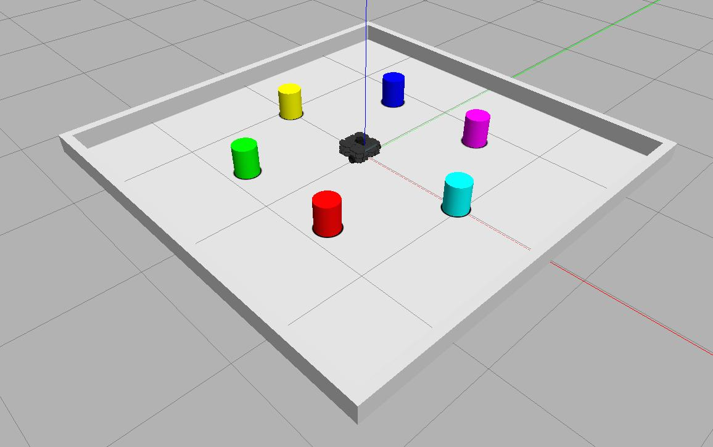

---  
title: Getting Started  
---  

There are a few things you should do now, before you start to sink your teeth into the Assignment Tasks themselves. Consider the tasks on this page as your "To-Do List" for Week 7 (the first week of Lab Assignment #2):

**To-Do**:

- [ ] [Step 1: Launch WSL-ROS and Restore Your Work](#step1)
- [ ] [Step 2: Download the Assignment #2 Simulation Resources](#step2)
- [ ] [Step 3: Set Up Your Team's ROS Package](#step3)
    - [ ] [3.1. Configuring Git in WSL-ROS](#git)
    - [ ] [3.2. Creating Your Team's Lab Assignment #2 ROS package](#create-pkg)
    - [ ] [3.3. Pushing Your Package to GitHub](#github)
    - [ ] [3.4. Transferring Your Package from WSL-ROS to a Robot Laptop](#laptop)
- [ ] [Step 4: Getting Started with the Real Robots](#step4)

## Step 1: Launch WSL-ROS and Restore Your Work {#step1}

* Load up your WSL-ROS environment by running the WSL-ROS shortcut in the Windows Start Menu. 
* When prompted, enter `Y` to restore your work.

    !!! note "Remember"
        You can also use the `wsl_ros restore` command to do this.

## Step 2: Download the Assignment #2 Simulation Resources {#step2}

We've put together a ROS package called `com2009_simulations` to help you with this assignment. This contains a number of simulation resources to help you work through the assignment #2 tasks. Where a task is to be assessed on a real robot, simulations are provided that are representative of the real-world environment that your robot might be placed in.

The `com2009_simulations` package is part of [the COM2009 Course Repo](https://github.com/tom-howard/COM2009), which you should have already downloaded to your own Catkin Workspace in [Assignment #1, Week 2](../../la1/week2/#course-repo). Follow the steps below now, to make sure you've got all the latest updates:

1. In a WSL-ROS terminal instance, navigate to the COM2009 repo:
   
    ```bash
    cd ~/catkin_ws/src/COM2009/
    ```

1. Then, pull down any updates from GitHub:  
  
    ```bash
    git pull
    ```

1. From the same terminal location, run `catkin build` to compile the new package (for good measure):

    ```bash
    catkin build com2009*
    ```
  
1. Finally, re-source your environment:

    ```bash
    source ~/.bashrc
    ```

1. To test that everything's working, launch a simulation environment called `beacon_colours` from the `com2009_simulations` package:
    
    ```bash
    roslaunch com2009_simulations beacon_colours.launch
    ```
    <center>
    <figure markdown>
      
      <figcaption>The `beacon_colours` arena, illustrating all possible colours that your robot might need to detect in the Assignment #2 Tasks.</figcaption>
    </figure>
    </center>

## Step 3: Set Up Your Team's ROS Package {#step3}

As discussed earlier, everything that your team submit for this lab assignment must be contained within a single ROS package. Inside this you will develop all the necessary nodes to make a TurtleBot3 Waffle (real or simulated) complete each of the assignment tasks. Each task will be assessed by the Teaching Team via *launch files* that you must also provide within your package. You'll therefore need to create one launch file per task (we'll talk more about this later).

It's best to create your team's ROS package in WSL-ROS to start with. We recommend that you then initialise this as a Git repo, and push it to GitHub to allow for sharing and collaboration amongst your team[^github-pro]. You should be able to transfer your package between WSL-ROS and a robot laptop using Git and GitHub (or other remote package repository) too, [see below for further details on this](#laptop).

[^github-pro]: As a University of Sheffield student, you can apply for the [GitHub Student Developer Pack](https://education.github.com/pack), which gives you access to a range of developer tools including *GitHub Pro*. GitHub Pro allows you to have unlimited collaborators on your repositories, which might help you to collaborate on your ROS package with your team.

Only one member of your team needs to create your ROS package and upload it to GitHub (or other). Regardless of who does this part though, you will **all** need to interact with Git for this assignment, and you should therefore *each* set up your own individual Git configurations in the WSL-ROS environment. Do this now by following the instructions in the next section...

### 3.1. Configuring Git in WSL-ROS {#git}

**All team members should do this bit!**

Git will automatically set your name and email address using the WSL-ROS username and the hostname of the remote machine that you are working on. It is important that this is changed to match your own personal identity!

1. From a WSL-ROS terminal instance located in your home directory run the following command to edit the Git configuration file:

    ```bash
    git config --global --edit
    ```
    
    This will open up the `.gitconfig` file in *Nano* (a terminal-based text editor). By default, this file should have the following content:

        # This is Git's per-user configuration file.
        [user]
        # Please adapt and uncomment the following lines:
        #	name = TUoS Student
        #	email = student@#####.shefuniad.shef.ac.uk

1. Uncomment the `name = ...` and `email = ...` lines by removing the `#` at the start of each of these lines in the file. Then, change `TUoS Student` and `student@#####.shefuniad.shef.ac.uk` to match your own personal identity.

1. Once done, press ++ctrl+x++ to exit Nano. Before it closes, you'll be asked if you want to save the changes that you have made, so enter ++y++ to confirm this and then press ++enter++ to confirm that you want to keep the same `/home/student/.gitconfig` file name (to overwrite the original content).

1. Finally, don't forget to run `wsl_ros backup` to save these changes to your external WSL-ROS backup file, so that they will always be restored whenever you run `wsl_ros restore` in a fresh WSL-ROS instance. 

### 3.2. Creating Your Team's Lab Assignment #2 ROS package {#create-pkg}

!!! note
    Only one team member actually needs to do this bit, but you will then need to share it with the rest of your team members via an online code repository (e.g. GitHub), by making the rest of your team members collaborators.

1. In a WSL-ROS terminal instance, navigate to the `catkin_ws/src` directory of the WSL-ROS filesystem:

    ```bash
    cd ~/catkin_ws/src/
    ```
  
1. Use the `catkin_create_pkg` tool to create a new ROS package in exactly the same way as you did multiple times during Lab Assignment #1:

    ```bash
    catkin_create_pkg com2009_team{} rospy
    ```

    ...replacing the `{}` with *your* team number!

    !!! warning
        It's really important that you follow the naming conventions that we specify when defining your package (and creating your launch files). If you don't then you could receive **no marks**!

1. Run `catkin build` and then re-source your environment:

    ```bash
    catkin build com2009_team{}
    ```
    ```bash
    source ~/.bashrc
    ```
  
1. Then navigate into the package directory that should have just been created:

    ```bash
    cd com2009_team{}/
    ```

1. This should already contain a `src` folder for you to populate with all your Python ROS nodes. Create a `launch` folder in here too, which you will use to store all your launch files:

    ```bash
    mkdir launch
    ```

1. Create a placeholder file in the `src` and `launch` directories, just to make sure that these folders both get pushed to GitHub when we get to that part in the following section:

    ```bash
    touch src/placeholder && touch launch/placeholder
    ```

    (you can delete these later on, once you start creating your own Nodes and launch files.)

1. Then follow the steps in the next section to import this project to GitHub (other online code repositories should work similarly)...

### 3.3. Pushing Your Package to GitHub {#github}

!!! note 
    Only one member of your team needs to do this bit too!

These instructions are taken from [this GitHub Docs page](https://docs.github.com/en/get-started/importing-your-projects-to-github/importing-source-code-to-github/adding-locally-hosted-code-to-github#adding-a-local-repository-to-github-using-git). Instructions may vary if you are using other online code repositories (such as GitLab for instance), so check with your target provider.

1. [Create a new (**private**) repository on GitHub.com](https://docs.github.com/en/repositories/creating-and-managing-repositories/creating-a-new-repository), but **DON'T** initialise the new repository with a README, license, or gitignore (you can do this later, it'll cause issues if you do it at this stage).

    <figure markdown>
      
      <figcaption>From [docs.github.com](https://docs.github.com/en/get-started/importing-your-projects-to-github/importing-source-code-to-github/adding-locally-hosted-code-to-github#adding-a-local-repository-to-github-using-git)</figcaption>
    </figure>

    Call this repository `com2009_team{}` to match the ROS package that you've just created.

1. Head back to the WSL-ROS terminal instance that you used to create your ROS package in the previous section. This should still be located in the root of your new package directory, but just to be sure, you can run: 

    ```bash
    roscd com2009_team{}
    ```

1. Initialise your package as a Git repo:
    
    ```bash
    git init -b main
    ```

1. Stage all the initial files in your package (including the placeholders) for an initial commit:

    ```bash
    git add .
    ```

    !!! warning
        Don't forget the `.` at the end there!

1. Then commit them:

    ```bash
    git commit -m "First commit"
    ```

1. Head back to GitHub. At the top of your repository on GitHub.com's Quick Setup page, click the :material-clipboard-outline: button to copy the remote repository URL (HTTPS).

    <figure markdown>
      
      <figcaption>From [docs.github.com](https://docs.github.com/en/get-started/importing-your-projects-to-github/importing-source-code-to-github/adding-locally-hosted-code-to-github#adding-a-local-repository-to-github-using-git)</figcaption>
    </figure>

1. Then, go back to your WSL-ROS terminal and add the URL to the remote repository:

    ```bash
    git remote add origin {REMOTE_URL}
    ```
    
    Change `{REMOTE_URL}` to the URL that you copied in the previous step, and **get rid of the curly brackets** (`{}`)!

    Then verify the new remote URL: 
    ```bash
    git remote -v
    ```

1. Finally, push the changes from your package in WSL-ROS (your "local" repo), to your "remote" repository on GitHub:

    ```bash
    git push origin main
    ```

    You'll then be asked to enter your GitHub username, followed by a password. **This password is not your GitHub account password**!  

    !!! warning
        **Your GitHub account password won't work here!** You'll need to [generate a personal access token (classic)](https://docs.github.com/en/authentication/keeping-your-account-and-data-secure/creating-a-personal-access-token#creating-a-personal-access-token-classic) and use this instead!

1. Back on GitHub, add your team members to the repo as collaborators. All team members should then be able to pull the remote repo into their own Catkin Workspaces (`cd ~/catkin_ws/src/` & `git clone {REMOTE_URL}`), make contributions and push these back to the remote repo as required.

### 3.4. Transferring Your Package from WSL-ROS to a Robot Laptop {#laptop}

You'll need to transfer your package to a robot laptop whenever you want to work on a real robot in the real robot arena during the labs! There is a Catkin Workspace on each of the robot laptops and (much the same as in the WSL-ROS environment) your package **must** reside within this workspace on the laptop too!

!!! note
    Make sure that the laptop is connected to "eduroam" when you try to do this!

1. From a terminal instance on the laptop navigate to the Catkin Workspace `src` directory:

    ```bash
    cd ~/catkin_ws/src
    ```

1. Clone your package into this directory using `git`:

    ```bash
    git clone {REMOTE_URL}
    ```

    Where `{REMOTE_URL}` is the https URL to your repo on GitHub.

1. Run Catkin Build to make sure that any resources within your package that need to be compiled (custom ROS messages, etc.) are compiled onto the laptop so that they can be used locally:
	
    ```bash
    catkin build com2009_team{}
    ```
	
	...again, replacing the `{}` with *your* team number.
	
1. Then, re-source your environment:
	
    ```bash
    source ~/.bashrc
    ```

    ??? tip "Pro Tip"
        There's a `src` alias for that command on the laptops too!
	
Don't forget to commit and push any updates that you make to your ROS package while working on the laptop back to your remote repository!

## Step 4: Getting Started with the Real Robots {#step4}

As you'll know by now, some Lab Assignment #2 Tasks will be assessed using real robots, and you'll therefore have access to the robots for every lab session from Week 7 onwards, so that you can work on these tasks as you wish. All the details on how the robots work, how to get them up and running and start programming them can be found in the "Waffles" section of this course site. You should proceed now as follows (**in your teams**):

1. Everyone **must** complete a health and safety quiz (on Blackboard) before you (or your team) work with the real robots for the first time. Head to Blackboard and do this now, if you haven't already.
1. Each team has been assigned a specific robot (there's a list on Blackboard). When you're ready, speak to a member of the teaching team who will provide you with the robot that has been assigned to you.
1. Work through each and every page of [the "Waffles" section of this site](../../../waffles), in order!

    Make sure you have a go at the [Initial Exercises](../../../waffles/exercises), which will help to get you started. Then, move onto the [Fact-Finding Missions](../../../waffles/fact-finding): there are 5 of these in total, and **it's really important that you complete them all**.  

<center>

**Setup complete, now on to the assignment tasks...**

</center>