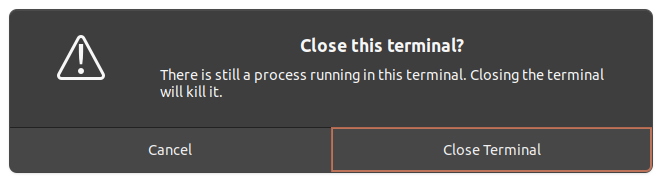
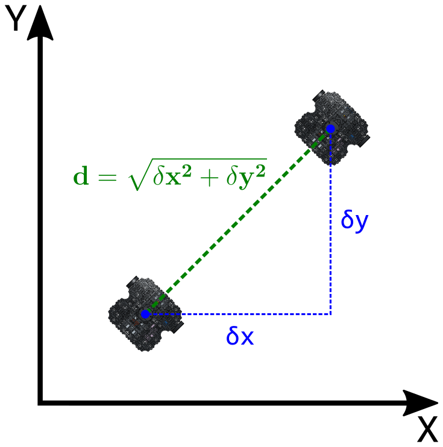
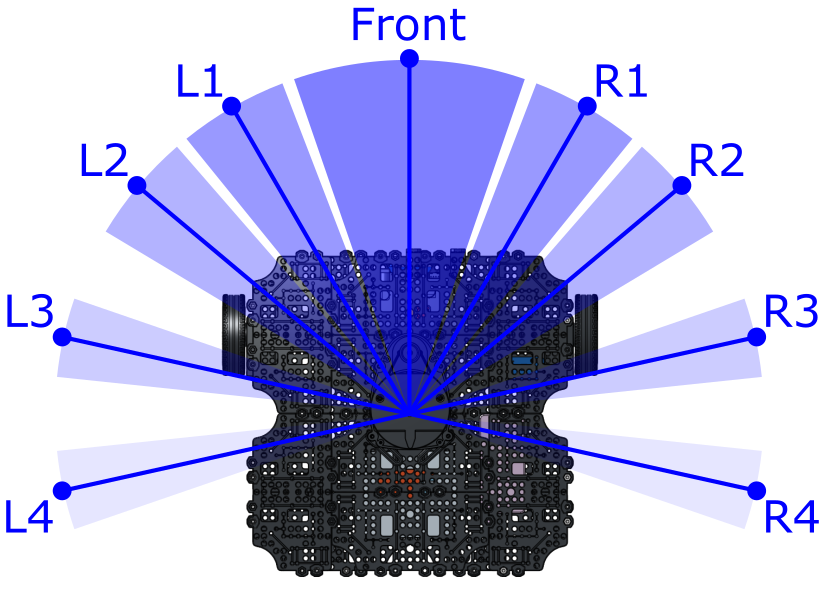
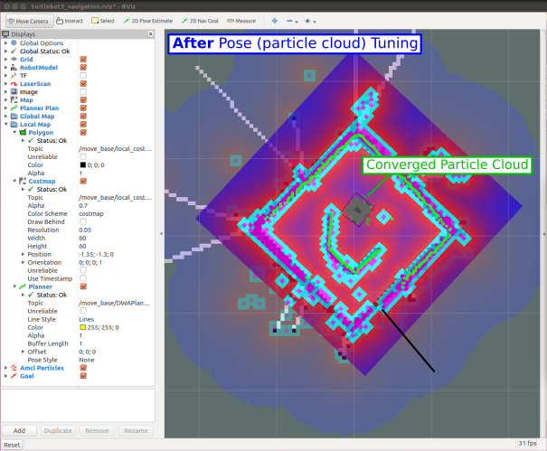

---  
title: "Lab 2: Feedback Control" 
---  

## Introduction

In Lab 1 we explored how ROS works and how to bring a robot to life. Let's quickly recap the key points:

**ROS Nodes**

* Are executable programs (Python, C++ scripts) that perform specific robot tasks and operations.
* Typically, there'll be many ROS Nodes running on a robot simultaneously in order to make it work.
* We can create our own Nodes on top of what's already running, to add extra functionality.
* You may recall that we created our own ROS Node in Python, to make our TurtleBot3 Waffle follow a square motion path.

<figure markdown>
  {width=500px}
</figure>

**Topics and Messages**

* All the ROS Nodes running on a network can communicate and pass data between one another using a Publisher/Subscriber-based Communication Principle.
* ROS Topics are key to this - they are essentially the communication channels (or the plumbing) on which all data is passed around between the nodes.
* Different topics communicate different types of information.
* Any Node can publish (*write*) and/or subscribe to (*read*) any ROS Topic in order to pass information around or make things happen.
* One of the key ROS Topics that we worked with last time was `/cmd_vel`, which is a topic that communicates velocity commands to make a robot move.
* We published `Twist` messages to this (both via the command line, and in Python) to make our TurtleBot3 Waffle move.

<figure markdown>
  {width=500px}
</figure>

**Open-Loop Control**

We used a time-based method to control the motion of our robot in order to get it to generate a square motion path. This type of control is *open-loop*: we hoped that the robot had moved (or turned) by the amount that was required, but had no *feedback* to tell us whether this had actually been achieved.

In this lab we'll look at how this can be improved, making use of some of our robot's on-board sensors to tell us where the robot is or what it can see in its environment, in order to complete a task more reliably and be able to better adapt to changes and uncertainty in the environment.

### Aims

In this lab, we'll build some ROS Nodes (in Python) that incorporate data from some of our robot's sensors. This sensor data is published to specific topics on the ROS Network, and we can build ROS Nodes to *subscribe* to these. We'll see how the data from these sensors can be used as *feedback* to inform decision-making, thus allowing us to implement some different forms of *closed-loop control*, thus making our robot more autonomous. 

### Intended Learning Outcomes

By the end of this session you will be able to:

1. Interpret the data from a ROS Robot's Odometry System and understand what this tells you about a Robot's position and orientation within its environment.
1. Use feedback from a robot's odometry system to *control* its position in an environment.
1. Use data from a Robot's LiDAR sensor to make a robot follow a wall.
1. Generate a map of an environment, using SLAM.
1. Make a robot navigate an environment *autonomously*, using ROS navigation tools.

### Quick Links

* [Exercise 1: Exploring Odometry Data](#ex1)
* [Exercise 2: Odometry-based Navigation](#ex2)
* [Exercise 3: Wall following](#ex3)
* [Exercise 4: SLAM and Autonomous Navigation](#ex4)

## The Lab

### Getting Started

#### Downloading the AMR31001 ROS Package

To start with, you'll need to download a ROS package to the Robot Laptop that you are working on today. This package contains all the resources that you'll need for the lab exercises.

1. Open up a terminal instance on the laptop, either by using the ++ctrl+alt+t++ keyboard shortcut, or by clicking the Terminal App icon in the favourites bar on the left-hand side of the desktop:
    
    <figure markdown>
      {width=60px}
    </figure>

1. In the terminal, run the following commands in order:

    !!! tip
        To **paste** the following commands into the terminal use ++ctrl+shift+v++
    
    ***
    ```bash
    wget -O build.sh https://raw.githubusercontent.com/tom-howard/amr31001/main/scripts/build.sh
    ```
    ```bash
    chmod +x build.sh
    ```
    ```bash
    ./build.sh
    ```
    ***

#### Launching ROS

Much the same as last time, you'll now need to get ROS up and running on your robot. 

1. First, identify the number of the robot that you have been provided with.

    Robots are named: `dia-waffleNUM`, where `NUM` is a unique *'Robot Number'* (a number between 1 and 50).

1. In the terminal, type the following command to *pair* the laptop and robot:

    ***
    ```bash
    waffle NUM pair
    ```
    Replacing `NUM` with the number of the robot that you have been provided with.
    
    ***

1. You *may* see a message like this early on in the pairing process:

    <figure markdown>
      {width=600px}
    </figure>

    If so, just type `yes` and then hit ++enter++ to confirm that you want to continue.

1. Enter the password for the robot when requested (if you can't remember what this is from last time then ask a member of the teaching team!)

    !!! note "Remember"
        You won't see anything change on the screen when you are entering the password. This is normal, just keep typing!!
    
1. Once the pairing process is finished you should see a message saying `pairing complete`, displayed in blue in the terminal. 

1. In the same terminal, enter the following command:

    ***
    ```bash
    waffle NUM term
    ```
    (again, replacing `NUM` with the number of *your* robot).
    
    ***

    A green banner should appear across the bottom of the terminal window:
    
    <figure markdown>
      {width=700px}
    </figure>

    Remember, this is a terminal instance running *on the robot*, and any commands that you enter here will be *executed on the robot* (not the laptop!)

1. Now, launch ROS on the robot by entering the following command:

    ***
    ```bash
    roslaunch tuos_tb3_tools ros.launch
    ```
    ***

    After a short while, you should see a message like this:

    ``` { .txt .no-copy }
    [INFO] [#####] --------------------------
    [INFO] [#####] dia-waffleNUM is up and running!
    [INFO] [#####] -------------------------- 
    ```

    The robot is now up and running, and you're ready to go!

1. Close down this terminal instance. If you see the following message, just click "Close Terminal."

    <figure markdown>
      {width=600px}
    </figure>

### Odometry

First, let's look at our robot's *odometry* system, and what this is useful for.

> Odometry is the use of data from motion sensors to estimate change in position over time. It is used in robotics by some legged or wheeled robots to estimate their position relative to a starting location. [^wiki]

[^wiki]: https://en.wikipedia.org/wiki/Odometry

Our robot can therefore keep track of its position (and orientation) as it moves around. It does this using data from two sources:

1. **Wheel encoders**: Our robot has two wheels, each is equipped with an encoder that measures the number of rotations that the wheel makes. 
1. An **Inertial Measurement Unit (IMU)**: Using accelerometers, gyroscopes and compasses, the IMU can monitor the linear and angular velocity of the robot, and which direction it is heading, at all times.

This data is published to a ROS Topic called `/odom`. 

#### :material-pen: Exercise 1: Exploring Odometry Data {#ex1}

In the previous lab we used some ROS commands to identify and interrogate active topics on the ROS network, let's give that another go now, but on the `/odom` topic this time.

1. Open up a new terminal instance on the laptop (by pressing ++ctrl+alt+t++, or clicking the Terminal App desktop icon, as you did before). We’ll call this one **TERMINAL 1**.

1. As you may recall from last time, we can use the `rostopic` command to *list* all the topics that are currently active on the network. Enter the following in **TERMINAL 1**:

    ***
    **TERMINAL 1:**
    ```bash
    rostopic list
    ```
    ***

    A large list of items should appear on the screen. Can you spot the `/odom` topic?
    
1. Let's find out more about this using the `rostopic info` command.

    ***
    **TERMINAL 1:**
    ```bash
    rostopic info /odom
    ```
    ***

    This should provide the following output:
    
    ```txt
    Type: nav_msgs/Odometry

    Publishers:
      * /turtlebot3_core (http://dia-waffleNUM:#####/)

    Subscribers: None
    ```

    !!! info "Post-lab Quiz"
        What does all this mean? We discussed this [last time (in relation to the `/cmd_vel` topic)](./lab1.md#rostopic_info_explained), and you may want to have a look back at this to refresh your memory! 
    
    One of the key things that this does tell us is that the `/odom` topic transmits data using a `nav_msgs/Odometry` message. All topics use standard message types to pass information around the ROS network. This is so that any node on the ROS network knows how to deal with the data, if it needs to. `nav_msgs/Odometry` is one of these standard message types. 
    
1. We can use the `rosmsg` command to find out more about this:

    ***
    **TERMINAL 1:**
    ```bash
    rosmsg info nav_msgs/Odometry
    ```
    ***

    You'll see a lot of information there, but try to find the line that reads `geometry_msgs/Pose pose`: 

    ```txt
    geometry_msgs/Pose pose
      geometry_msgs/Point position
        float64 x
        float64 y
        float64 z
      geometry_msgs/Quaternion orientation
        float64 x
        float64 y
        float64 z
        float64 w
    ```

    Here's where we'll find information about the robot's position and orientation (aka *"Pose"*) in the environment. Let's have a look at this data in real time...

1. We can look at the live data being streamed across the `/odom` topic, using the `rostopic echo` command. We know that this topic uses `nav_msgs/Odometry` type messages, and we know which part of these messages we are interested in (`geometry_msgs/Pose pose`)

    ***
    **TERMINAL 1:**
    ```bash
    rostopic echo /odom/pose/pose
    ```
    ***

1. Now, let's drive the robot around a bit and see how this data changes as we do so. Open up a new terminal instance by pressing ++ctrl+alt+t++, or clicking the Terminal App desktop icon, as you did before. We'll call this one **TERMINAL 2**.

1. Remember that node that we used last time that allowed us to control the motion of the robot using different buttons on the keyboard? Let's launch that again now:

    ***
    **TERMINAL 2:**
    ```bash
    rosrun turtlebot3_teleop turtlebot3_teleop_key
    ```
    ***

1. Follow the instructions provided in the terminal to drive the robot around:

    As you're doing this, look at how the `position` and `orientation` data is changing in **TERMINAL 1**, in real-time!

    !!! info "Post-lab Quiz"
        Which position and orientation values change (by a significant amount) when:
            
        1. The robot turns on the spot (i.e. only an *angular* velocity is applied)?
        1. The robot moves forwards (i.e. only a *linear* velocity is applied)?
        1. The robot moves in a circle (i.e. both a linear *and* angular velocity are applied simultaneously)?

        **Make a note of the answers to these questions, as they may feature in the post-lab quiz!**

1. When you've seen enough enter ++ctrl+c++ in **TERMINAL 2** to stop the `turtlebot3_teleop_keyboard` node. Then, enter ++ctrl+c++ in **TERMINAL 1** as well, which will stop the live stream of Odometery messages from being displayed.

##### Summary

**Pose** is a combination of a robot's *position* and *orientation* in its environment.

**Position** tells us the location (in meters) of the robot in its environment. Wherever the robot was when it was turned on is the reference point, and so the distance values that we observed in the exercise above were all quoted relative to this initial position.

You should have noticed that (as the robot moved around) the `x` and `y` terms changed, but the `z` term should have remained at zero. This is because the `X-Y` plane is the floor, and any change in `z` position would mean that the robot was floating or flying above the floor! 

**Orientation** tells us where the robot is pointing in its environment, expressed in units of *Quaternions*; a four-term orientation system. You should have noticed some of these values changing too, but it may not have been immediately obvious what the values really meant! For the further exercises in this lab we'll convert this to Euler angles (in degrees/radians) for you, to make the data a bit easier to understand.

Ultimately though, our robots *position* can change in both the `X` and `Y` axes (i.e. the plane of the floor), while its *orientation* can only change about the `Z` axis (i.e. it can only "yaw"): 

<figure markdown>
  
</figure>

#### :material-pen: Exercise 2: Odometry-based Navigation {#ex2}

Now that we know about the odometry system and what it tells us, let's see how this could be used as a feedback signal to inform robot navigation. You may recall that last time you created a ROS Node to make your robot to follow a square motion path on the floor. This was time-based though: given the speed of motion (turning or moving forwards) it was possible to determine the time it would take for the robot to move by a required distance. Having determined this, we then added timers to our node, to control the switch between moving forwards and turning on the spot, in order to generate the square motion path (approximately). 

In theory though, we can do all this much more effectively with odometry data instead, so let's have a go at that now...

1. Open up the `amr31001` ROS package that you downloaded earlier into VS Code using the following command in **TERMINAL 1**:

    ***
    **TERMINAL 1:**
    ```bash
    code ~/catkin_ws/src/amr31001
    ```
    ***

1. In VS Code, navigate to the `src` directory in the File Explorer on the left-hand side, and click on the `ex2.py` file to display it in the editor.

1. Have a look through the code and see if you can work out what's going on. There are a few things to be aware of:

    1. Motion control is handled by an external Python module called `waffle`, which is imported on line 4:

        ```python
        import waffle
        ```

        and instantiated on line 16:

        ```python
        motion = waffle.Motion()
        ```

        In the main part of the code, this can be used to control the velocity of the robot, using the following methods:

        1. `motion.move_at_velocity(linear = x, angular = y)` to make the robot move at a linear velocity of `x` (m/s) and/or an angular velocity of `y` (rad/s).
        1. `motion.stop()` to make the robot stop moving.
    
    1. Subscribing to the `/odom` topic and the processing of the `nav_msgs/Odometry` data is also handled by the `waffle` module, so you don't have to worry about it! This functionality is instantiated on line 17:

        ```python
        pose = waffle.Pose()
        ```

        So all that you have to do in order to access the robot's odometry data in the main part of the code is call the appropriate attribute:

        1. `pose.posx` to obtain the robot's current position (in meters) in the `X` axis.
        1. `pose.posy` to obtain the robot's current position (in meters) in the `Y` axis.
        1. `pose.yaw` to obtain the robot's current orientation (in degrees) about the `Z` axis.

1. Run the code in **TERMINAL 1** and observe what happens:

    ***
    **TERMINAL 1:**
    ```bash
    rosrun amr31001 ex2.py
    ```
    ***

    The robot should start turning on the spot, and you should see some interesting information being printed to the terminal. After it has turned by 45&deg; the robot should stop. 

1. Stop the Node by entering ++ctrl+c++ in **TERMINAL 1** and then run it again (`rosrun amr31001 ex2.py`) if you missed what happened the first time!

1. **What you need to do**:

    1. In the `while()` loop there is an `if` statement with a condition that handles the turning process: 
    
        ```python
        elif movement == "turn":
        ```
        
        Within this, look at how the robot's yaw angle is being monitored and updated as it turns. Then, look at how the turn angle is being controlled. See if you can adapt this to make the robot turn in 90&deg; steps instead.

    1. Ultimately, after the robot has turned by 90&deg; it needs to then move forwards by 0.5m, in order to achieve a 0.5x0.5m square motion path.
        
        Moving forwards is handled by an additional condition within the `if` statement:
        
        ```python
        elif movement == "move_fwd":
        ```
        See if you can adapt the code within this block to make the robot move forwards by the required amount (0.5 meters) in between each turn. <a name="the_hint"></a>
        
        ??? note "Hint"
            Consider how the turn angle is monitored and updated whist turning (`current_yaw`), and take a similar approach with the linear displacement (`current_distance`). Bear in mind that you'll need to consider the *euclidean distance*, which you'll need to calculate based on the robot's position in both the `x` and `y` axis.
        
            <figure markdown>
              {width=500px}
            </figure>

    1. **Make sure that you've saved any changes to the code (in VS Code) before trying to test it out on the robot!**
    
        Do this by using the ++ctrl+s++ keyboard shortcut, or going to `File > Save` from the menu at the top of the screen.
    
    1. Once you've saved it, you can re-run the code at any time by using the same `rosrun` command as before:

        ***
        **TERMINAL 1:**
        ```bash
        rosrun amr31001 ex2.py
        ```
        ***

        ... and you can stop it at any time by entering ++ctrl+c++ in the terminal.

        ??? tip "Python Tips"

            You'll need to do a bit of maths here (see [the "Hint" above](#the_hint)). Here's how to implement a couple of mathematical functions in Python:

            1. **To the power of...**: Use `**` to raise a number to the power of another number (i.e. $2^{3}$):

                ```py
                >>> 2**3
                8
                ``` 

            1. **Square Root**: To calculate the square root of a number (i.e. $\sqrt{4}$):

                ```py
                >>> sqrt(4)
                2.0 
                ```
    
    !!! info "Post-lab Quiz"
        Keep a record of what you do here to complete this programming task, you may be asked about it in the post-lab quiz.

### The LiDAR Sensor

As you'll know, the black spinning device on the top of your robot is a *LiDAR Sensor*. As discussed previously, this sensor uses laser pulses to measure the distance to nearby objects. The sensor spins continuously so that it can fire these laser pulses through a full 360&deg; arc, and generate a full 2-dimensional map of the robot's surroundings.

This data is published to a ROS Topic called `/scan`. Use the same methods that you used in [Exercise 1](#ex1) to find out what message type is used by this ROS Topic.

!!! info "Post-lab Quiz"
    Make a note of this, there'll be a post-lab quiz question on it!

Launch RViz, so that we can see the data coming from this sensor in real-time:

***
**TERMINAL 1:**
```bash
roslaunch tuos_tb3_tools rviz.launch
```
***

<figure markdown>
  {width=800px}
</figure>

The red dots illustrate the LiDAR data. Hold your hand out to the robot and see if you can see it being detected by the sensor... a cluster of red dots should form on the screen to indicate where your hand is located in relation to the robot. Move your hand around and watch the cluster of dots move accordingly. Move your hand closer and farther away from the robot and observe how the red dots also move towards or away from the robot on the screen. 

This data is really useful and (as we observed during the previous lab session) it allows us to build up 2-dimensional maps of an environment with considerable accuracy. This is, of course, a very valuable skill for a robot to have if we want it to be able to navigate autonomously, and we'll explore this further later on. For now though, we'll look at how we can use the LiDAR data ourselves to build Nodes that make the robot detect and follow walls!

Once you're done, close down RViz by hitting ++ctrl+c++ in **TERMINAL 1**. 

#### :material-pen: Exercise 3: Wall following {#ex3}

1. In VS Code, click on the `ex3.py` file in the File Explorer to display it in the editor.

1. Have a look through the code and see if you can work out what's going on. Here's a few points to start with:

    1. Velocity control is handled in the same way as in the previous exercise:

        1. `motion.move_at_velocity(linear = x, angular = y)` to make the robot move at a linear velocity of `x` (m/s) and/or an angular velocity of `y` (rad/s).
        1. `motion.stop()` to make the robot stop moving.
    
    1. The data from the LiDAR sensor has been preprocessed and encapsulated in an additional class from the `waffle` module. This functionality is instantiated on line 13:

        ```python
        lidar = waffle.Lidar()
        ```

        This class splits up data from the LiDAR sensor into a number of different segments to focus on a number of distinct zones around the robot's body (to make the data a bit easier to deal with). For each of the segments (as shown in the figure below) a single distance value can be obtained, which represents the average distance to any object(s) within that particular angular zone:

        <figure markdown>
          {width=500px}
        </figure>

        In the code, we can obtain the distance measurement (in meters) from each of the above zones as follows:

        1. `lidar.distance.front` to obtain the average distance to any object(s) in front of the robot (within the frontal zone).
        1. `lidar.distance.l1` to obtain the average distance to any object(s) located within LiDAR zone L1.
        1. `lidar.distance.r1` to obtain the average distance to any object(s) located within LiDAR zone R1.  
            and so on...
    
    1. The code template has been developed to detect a wall on the robot's *left-hand side*.
        1. We use distance measurements from LiDAR zones L3 and L4 to determine the alignment of the robot to a left-hand wall.
        1. This is determined by calculating the difference between the distance measurements reported from these two zones:

            ```python
            wall_rate = lidar.distance.l3 - lidar.distance.l4
            ```
        
        1. If this value is close to zero, then the robot and the wall are well aligned. If not, then the robot is at an angle to the wall, and it needs to adjust its angular velocity in order to correct for this:

            <figure markdown>
              
            </figure>  

1. Run the node, as it is, from **TERMINAL 1**:

    ***
    **TERMINAL 1:**
    ```bash
    rosrun amr31001 ex3.py
    ```
    ***

    When you do this, you'll notice that the robot doesn't move at all (yet!), but the following data appears in the terminal:
    
    1. The distance measurements from each of the LiDAR zones.
    1. The current value of the `wall_rate` parameter, i.e. how well aligned the robot currently is to a wall on its left-hand side.
    1. The decision that has been made by the `if` statement on the appropriate action that should be taken, given the current value of `wall_rate`.

1. **What you need to do**:

    1. First, place the robot on the floor with a wall on its left-hand side
    1. Manually vary the alignment of the robot and the wall and observe how the information that is being printed to the terminal changes as you do so.
        
        !!! note "Question"
            The node will tell you if it thinks the robot needs to turn right or left in order to improve its current alignment with the wall. **Is it making the correct decision?**

    1. Currently, all velocity parameters inside the `#!python while()` loop are set to zero.
        * You'll need to set a constant *linear* velocity, so that the robot is always moving forwards. Set an appropriate value for this now, by editing the line that currently reads:

            ```python
            lin_vel = 0.0
            ```
        
        * The *angular* velocity of the robot will need to be adjusted conditionally, in order to ensure that the value of `wall_rate` is kept as low as possible at all times. Adjust the value of `ang_vel` in each of the `if` statement blocks so that this is achieved under each of the three possible scenarios.
    1. Hopefully, by following the steps above, you will get to the point where you can make the robot follow a wall reasonably well, as long as the wall remains reasonably straight! Consider what would happen however if the robot were faced with either of the following situations:

        <figure markdown>
          
        </figure>

        You may have already observed this during your testing... how could you adapt the code so that such situations can be achieved?

        ??? info "Hints"
            
            1. You may need to consider the distance measurements from some other LiDAR zones!
            1. The `ex3.py` template that was provided to you uses an `if` statement with three different cases:
                
                ```python
                if ...:

                elif ...:

                else:

                ```

                You may need to add in some further cases to this to accommodate the additional situations discussed above, e.g.:

                ```python
                if ...:

                elif ...:
                
                elif ...:
                
                elif ...:
                
                else:
                
                ```

        
    1. Finally, think about how you could adapt this algorithm to make the robot follow a wall on its right-hand side instead.

    !!! info "Post-lab Quiz"
        Keep a record of what you do here to complete this programming task, you may be asked about it in the post-lab quiz.  

### SLAM and Autonomous Navigation

We've played around with the data from both the LiDAR sensor and the robot's Odometry System now, so hopefully you now understand what these two systems can tell us about our robot and its environment, and how this information is very valuable for robotic applications.

To illustrate this further, we'll now have a look at two extremely useful tools that are built into ROS, and that use the data from these two sensors alone to achieve powerful results!

**Simultaneous Localisation and Mapping (SLAM)**

As you now know, the LiDAR sensor gives us a full 360&deg; view of our robot's environment. As the robot moves around it starts to observe different features in the environment, or perhaps the same features that it has already seen, but at a different perspective. Using the LiDAR data in combination with our robots *Pose* and *Velocity* (as provided by the Odometry System), we can actually build up a comprehensive 2-dimensional map of an environment and keep track of where our robot is actually located within that map, at the same time. This is a process called **SLAM**, and you may remember that we had a go at this in the previous lab session.

**Navigation**

Having built a complete map (using SLAM) our robot then knows exactly what its environment looks like, and it can then use the map to work out how to get from one place to another on its own! 

In the next exercise, we'll have a go at this: first we need to build a map, then we can use that map to implement *autonomous navigation*!

#### :material-pen: Exercise 4: SLAM and Navigation {#ex4}

**Step 1: Mapping**

1. Make sure none of your code from the previous exercise is still running now, **TERMINAL 1** should be idle, ready to accept some new instructions!

1. Place your robot in the enclosure that we have created in the lab. 

1. Then, in **TERMINAL 1**, run the following command:

    ***
    **TERMINAL 1:**
    ```bash
    roslaunch amr31001 ex4_slam.launch
    ```
    ***

    An RViz screen will open up showing the robot from a top-down view, with the LiDAR data represented by green dots.

    <figure markdown>
      
    </figure>

    SLAM is already working, and you should notice black lines forming underneath the green LiDAR dots to indicate the regions that SLAM has already determined as static and which therefore represent boundaries in the environment.

1. In **TERMINAL 2** launch the `turtlebot3_teleop_keyboard` node again, to drive the robot around:

    ***
    **TERMINAL 2:**
    ```bash
    rosrun turtlebot3_teleop turtlebot3_teleop_key
    ```
    ***

1. Drive the robot around until SLAM has built up a complete map of the entire arena.

    <figure markdown>
      
    </figure>

1. Once you're happy with this, stop the `turtlebot3_teleop_keyboard` node by hitting ++ctrl+c++ in **TERMINAL 2**. You can also stop SLAM now too, so head back to **TERMINAL 1** and enter ++ctrl+c++ to stop this too.

1. While you were doing the above, a map file was being constantly updated and saved to the laptop's filesystem. Have a quick look at this now to make sure that the map that you have built is indeed a good representation of the environment:

    ***
    **TERMINAL 1:**
    ```bash
    eog ~/catkin_ws/src/amr31001/maps/my_map.pgm
    ```
    ***

    If the map looks like the actual arena then you're good to move on, but if not then you may need to repeat the above steps again to give it another go.

**Step 2: Navigating Autonomously**

Using the map that you've just created you should now be able to make your robot navigate around the real environment!

1. Launch the navigation processes in **TERMINAL 1** by entering the following command:

    ***
    **TERMINAL 1:**
    ```bash
    roslaunch amr31001 ex4_nav.launch
    ```
    ***

    RViz should then open up again, once again with a top-down view of the robot, but this time with the map that you generated earlier displayed underneath it (in black).  

1. To begin with, the robot needs to know *roughly* where it is within this map, and we can tell it this by performing a manual *"2D Pose Estimation"*.  

    1. Press the "2D Pose Estimate" button at the top of the RViz screen.  
    1. The map should be visible (in black) in the background underneath all the live LiDAR Data (displayed in green), but the two are probably not lined up properly. Move the cursor to the approximate point on the background map at which the robot is actually located.  
    1. Press and hold the left mouse button and a large green arrow will appear.  
    1. Whilst still holding down the left mouse button, rotate the green arrow to set the robot's *orientation* within the map.  
    1. Let go of the left mouse button to set the pose estimation. If done correctly, the real-time LiDAR data should nicely overlap the background map after doing this:
    
        <figure markdown>
          
        </figure>

        ... if not, then have another go!

1. We then need to give the robot a chance to determine its pose more accurately. The navigation processes that are running in the background are currently generating what's called a *"localisation particle cloud"*, which is displayed as lots of tiny green arrows surrounding the robot in RViz. The scatter of these green arrows indicates the level of certainty the robot currently has about its *true* pose (position and orientation) within the environment: a *large* scatter indicates a high level of *uncertainty*, and we need to improve this before we can make the robot navigate around autonomously.

    We can improve this by simply driving the robot around the environment a bit, so that it gets the opportunity to see different walls and obstacles from different perspectives. In the background, the navigation algorithms will be comparing the real time LiDAR data with the background map that was generated earlier, and when the two things line up well, the robot becomes more certain about its pose in the environment.

    Once again, launch the `turtlebot_teleop_keyboard` node in **TERMINAL 2**, and drive the robot around a bit:

    ***
    **TERMINAL 2:**
    ```bash
    rosrun turtlebot3_teleop turtlebot3_teleop_key
    ```
    ***

    As you're doing this, watch how the scatter in the localisation particle cloud reduces, and the small green arrows begin to converge underneath the robot.

    <figure markdown>
      
    </figure>

1. Now, click the "2D Nav Goal" button:  
    1. Move the cursor to the location that you want the robot to move to on the map. 
    1. Click and hold the left mouse button and a large green arrow will appear again to indicate that the *position* goal has been set.  
    1. Whilst still holding the left mouse button, rotate the green arrow around to set the desired *orientation* goal.  
    1. Release the mouse button to set the goal...
    
        The robot will then try its best to navigate to the destination autonomously!

    !!! info "Post-lab Quiz"
        What does a ROS robot need in order to be able to navigate an environment autonomously?

## Wrapping Up

Before you leave, please turn off your robot! Enter the following command in **TERMINAL 1** to do so:

***
**TERMINAL 1:**
```bash
waffle NUM off
```
... again, replacing `NUM` with the number of the robot that you have been working with today.
***

You'll need to enter `y` and then hit ++enter++ to confirm this.

Please then shut down the laptop, which you can do by clicking the battery icon in the top right of the desktop and selecting the "Power Off / Log Out" option in the drop-down menu.

<figure markdown>
  
</figure>

<center>

**AMR31001 Lab 2 Complete!**  

</center>