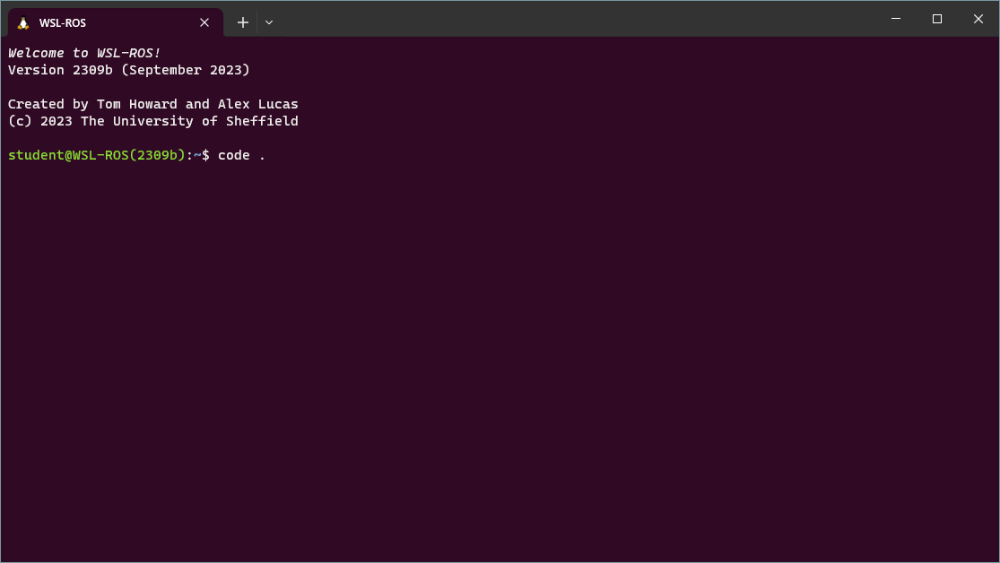
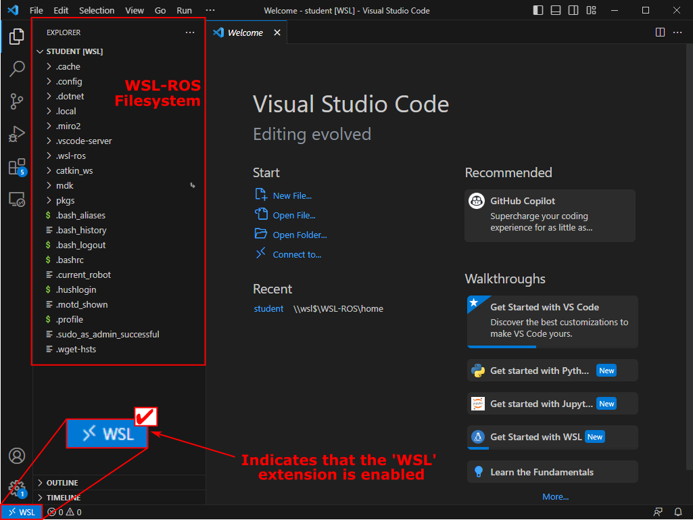
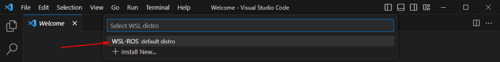
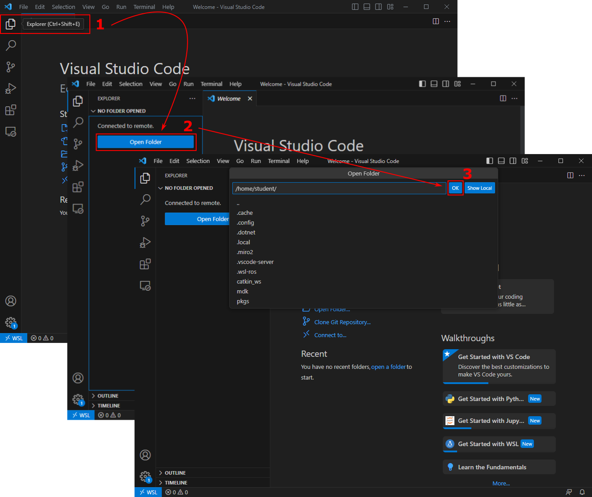
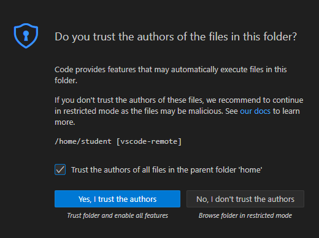

---  
title: "VS Code and WSL"  
---

# VS Code and WSL

## Launching VS Code from the Terminal {#the-top}

1. You can launch VS Code directly from a WSL-ROS terminal instance. Simply type `code .` and then hit ++enter++ :

    <figure markdown>
      
    </figure>

1. A warning message may then pop up:

    <figure markdown>
      
    </figure>

    Check the box to "Permanently allow host 'wsl$'" and then click the "Allow" button.

1. VS Code should then launch, and you'll be presented with another trust dialogue:

    <figure markdown>
      
    </figure>

    Click the blue "Yes, I trust the authors" button.

## Installing the WSL Extension {#wsl-ext}

1. The first time you launch VS Code (as above) you should be presented with a pop-up in the bottom-right of the screen, asking if you would like to "install the recommended 'WSL' extension from Microsoft..."

    <figure markdown>
      
    </figure>

    Click on the blue "Install" button.

    ??? bug "Don't see the pop-up?" 
        
        You can also install the 'WSL' extension manually.
        
        Click on the "Extensions" icon in the left-hand toolbar (or hit ++ctrl+shift+x++ ), type "wsl" in the search box and hit the install button on the right extension, as show below:

        <figure markdown>
          {width=600}
        </figure>

1. Once installed, close down VS Code, go back to the WSL-ROS terminal instance and re-launch it using the `code .` command again.
    
    This time, you may be presented with *yet another* trust pop-up dialogue:

    <figure markdown>
      
    </figure>

    Once again, check the box to "Trust the authors" and then click the blue "Yes, I trust the authors" button. 

1. You can now navigate the WSL-ROS filesystem in the explorer window on the left-hand side of the VS Code screen. You'll need to use this to locate the packages and scripts that you create throughout this course!

    <figure markdown>
      
    </figure>

    !!! warning "Important" 
        
        **Always make sure that the "WSL" extension is enabled!!**

        If you don't see the WSL icon at the bottom-left of your screen (as shown below) then [start again from the top](#the-top) or follow [the alternative instructions below](#alt-launch).

        <figure markdown>
          {width=400}
        </figure>

## Accessing WSL-ROS from VS Code (Alternate Method) {#alt-launch}

It's really important to make sure VS Code is launched within the WSL-ROS environment each time you work with it. Having followed the steps above, if the blue WSL icon is visible in the bottom-left corner of the VS Code screen then you're all good. If not, then try this method to load it correctly instead.

1. First, make sure WSL-ROS is running by following [the steps outlined here](./getting-started.md#launching-wsl-ros).

1. Launch VS Code from **the Windows Application Menu** by clicking the Windows Start Menu button: 

1. Type `vscode` (or just `code` works as well) and click on the application shortcut that should then appear in the list:

    <figure markdown>
      
    </figure>

1. You should have already [installed the "WSL" extension](#wsl-ext). If so, click the blue "remote window" icon and then click the `Connect to WSL using Distro...` option in the menu that appears:

    <figure markdown>
      {width=600}
    </figure>

1. Then, click on `WSL-ROS` to select it.

    <figure markdown>
      {width=600}
    </figure>

1. The blue "remote window" icon in the bottom left-hand corner should change now to indicate that VS Code is now running inside WSL-ROS:

    <figure markdown>
      {width=400}
    </figure>

1. Next, access the WSL-ROS filesystem by:
    1. Clicking the "Explorer" icon in the left-hand toolbar (or by using the ++ctrl+shift+e++ keyboard shortcut),
    1. Clicking the blue `"Open Folder"` button,
    1. Clicking `"OK"` to select the default `/home/student/` filesystem location.

    <figure markdown>
      {width=600}
    </figure>

1. Finally, you should be presented with a pop-up asking if you trust the WSL-ROS home directory. Tick the checkbox and click on the blue `"Yes, I trust the authors"` button:

    <figure markdown>
      {width=400}
    </figure>

1. VS Code should now be good to go...

    <figure markdown>
      
    </figure>

## Always make sure that the "WSL" extension is enabled!! {#verify}

Check that your blue "Remote Window" icon in the bottom-left of the VS Code screen always looks like this:

<figure markdown>
  {width=400}
</figure>

If not, then go back to [the top of this page](#the-top) and try again!
