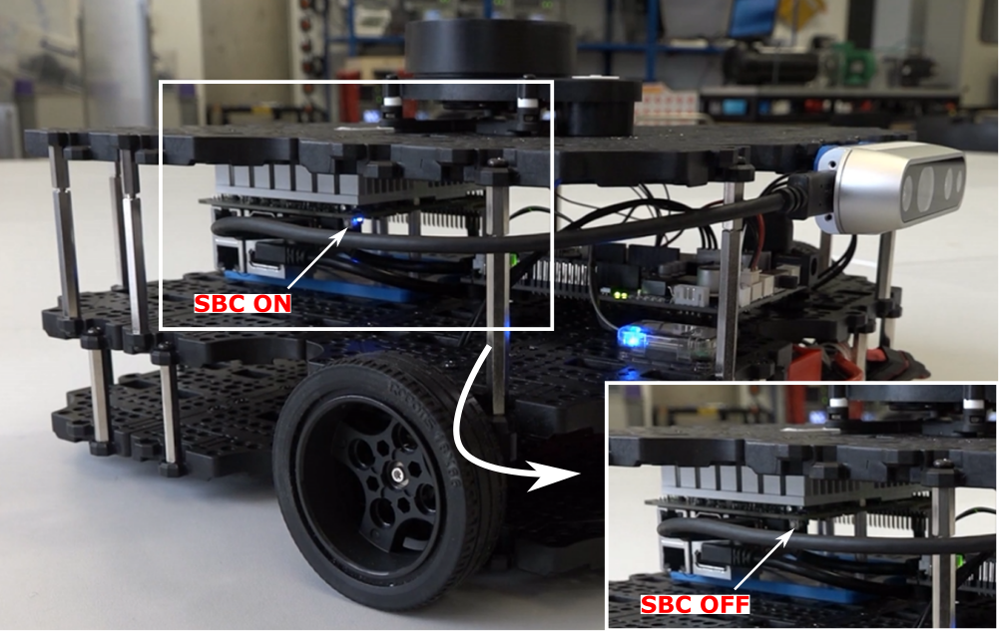

---  
title: Shutdown Procedures 
---

## Deleting your ROS Package

Remember that the laptops use an account that everyone in the class has access to. You therefore might want to delete your team's ROS package from the laptop at the end of each lab session, and clone it back on again at the start of the following lab session. 

!!! warning
    Make sure you've pushed any changes to GitHub before deleting your package!

Deleting your package (by following the instructions below) **won't** delete your SSH key from the laptop, so you won't need to do all the SSH key-gen processes again, and your SSH key will still be protected with the secret passphrase that you set up when generating the SSH Key to begin with (assuming that you are working on the same laptop, of course!) 

!!! info
    Not working with the same laptop? [You can find all the instructions on how to clone your package onto a laptop using SSH here.(TODO)]()

Delete your package by simply running the following command from any terminal on the laptop:

```bash
rm -rf ~/catkin_ws/src/com2009_team999
```

... replacing `999` with your own team's number!

## Shutdown Procedures

As you should know, the Waffles are powered by [a Single Board Computer (SBC)](../../about/robots/#tb3), which runs a full-blown operating system (Ubuntu 20.04). As with any operating system, it's important to **shut it down properly**, rather than simply disconnecting the power, to avoid any data loss or other issues. 

Therefore, once you've finished working with a robot during a lab session, follow the steps below to shut it down.

1. Open a **new** terminal instance on the laptop (++ctrl+alt+t++), and enter the following:

    ***
    ```bash
    waffle X off
    ```
    ... replacing `X` with the number of the robot that you have been working with.
    ***

1. You'll be asked to confirm that you want to shut the robot down: 

        [INPUT] Are you sure you want to shutdown dia-waffleX? [y/n] >> 
    
    Enter `y` and hit ++enter++ and the robot's SBC will be shut down. 

1. Once the blue light on the corner of the SBC goes out, it's then safe to slide the power button to the **left** to completely turn off the device. 

    <figure markdown>
      {width=650px}
    </figure>

1. Once you've turned off the robot, remember to shut down the laptop too! Do this by clicking the battery icon in the top right of the desktop and selecting the "Power Off / Log Out" option in the drop-down menu.

    <figure markdown>
      {width=300px}
    </figure>

<center>
  <strong>
    Hand your robot and laptop back to a member of the teaching team who will put it away for you!
  </strong>
</center>