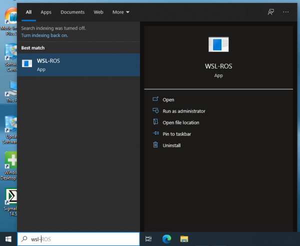
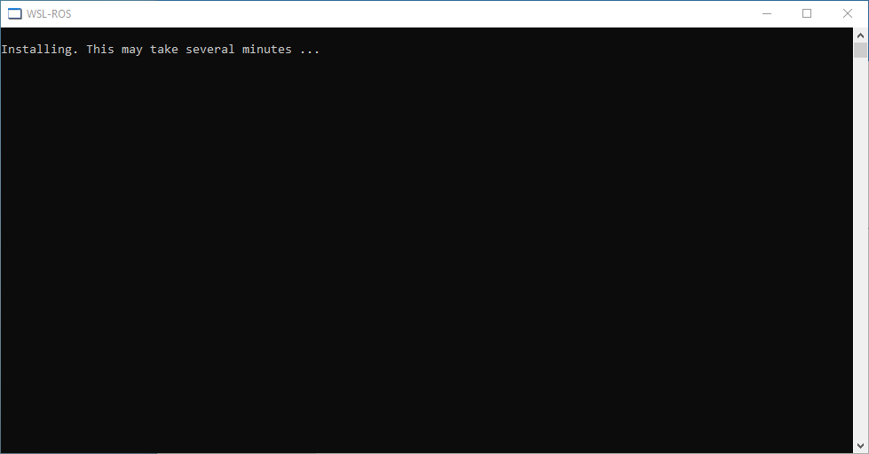
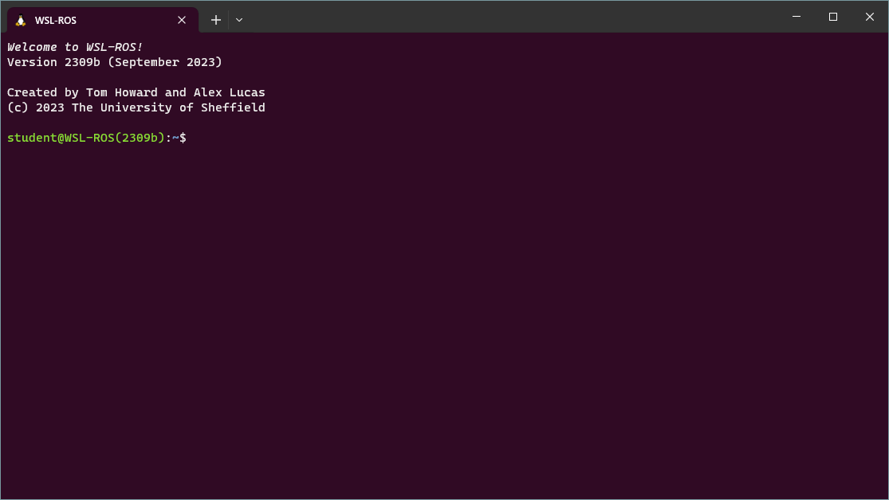

# Launching WSL-ROS for the First Time

Click the Windows Start Menu button: 
    
Then, start typing `"wsl-ros"` and click on the application shortcut that should then appear in the list:

<figure markdown>
  
</figure>

You will be presented with the following screen:

<figure markdown>
  {width=700}
</figure>

WSL-ROS is now being installed from the custom OS image, which may take a couple of minutes to complete.  Once it's done, the *Windows Terminal* should automatically launch:

<figure markdown>
  
</figure>

This is an *Ubuntu Terminal Instance*, giving us access to the Ubuntu 20.04 operating system that we have just installed. This is the **WSL-ROS Environment**!

<strong><em>You're all set up and ready to go!</em></strong>

