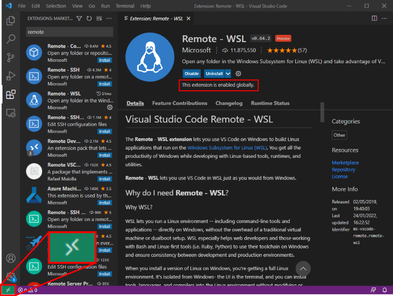

---  
title: "Launching Visual Studio Code in WSL-ROS"  
---

!!! info
    On the University Managed Desktops, you should follow these steps to launch VS Code every time you need to use it!

## Procedure {#the-top}

1. Launch VS Code from **the Windows Application Menu** by clicking the Windows Start Menu button: 

1. Type `"vscode"` (or just `"code"` works as well) and click on the application shortcut that should then appear in the list:

    <figure markdown>
      
    </figure>

1. You should have already [installed the "WSL" extension](../configure-vscode). If so, then a green icon should be visible in the bottom left-hand corner of the application window:

    <figure markdown>
      {width=600}
    </figure>

    Click the green icon and then click the `"New WSL Window using Distro..."` option in the menu that appears:

    <figure markdown>
      {width=600}
    </figure>

1. Then, click on `"WSL-ROS"` to select it (it *should* be the only one in the list).

    <figure markdown>
      {width=600}
    </figure>

1. A new VS Code instance should launch, and in this one you should see the green "Remote" icon in the bottom left-hand corner again, but this time the icon should also contain the text: `"WSL: WSL-ROS"`, indicating that the remote extension has been launched inside WSL-ROS:

    <figure markdown>
      {width=600}
    </figure>

1. Keep this new VS Code instance open, but close down the original one behind it.

1. Next, access the WSL-ROS filesystem by:
    1. Clicking the "Explorer" icon in the left-hand toolbar (or use the `Ctrl+Shift+E` keyboard shortcut),
    1. Clicking the blue `"Open Folder"` button,
    1. Clicking `"OK"` to select the default `/home/student/` filesystem location.

    <figure markdown>
      {width=600}
    </figure>

1. Finally (we're nearly there, I promise!), you should be presented with a pop-up, asking if you trust the `/home/student [WSL: WSL-ROS]` folder. Tick the checkbox and click on the blue `"Yes, I trust the authors"` button:

    <figure markdown>
      
    </figure>

1. You can now navigate the WSL-ROS filesystem in the explorer window on the left-hand side of the VS Code screen. You'll need to use this to locate the packages and scripts that you create throughout this course!

    <figure markdown>
      {width=600}
    </figure>

## Always make sure that the "WSL" extension is enabled!! {#verify}

Check that you can always see this icon in the bottom left-hand corner of your VS Code screen:

<figure markdown>
  {width=600}
</figure>

!!! warning
    If you don't see this then [start again from the top](#the-top)!
